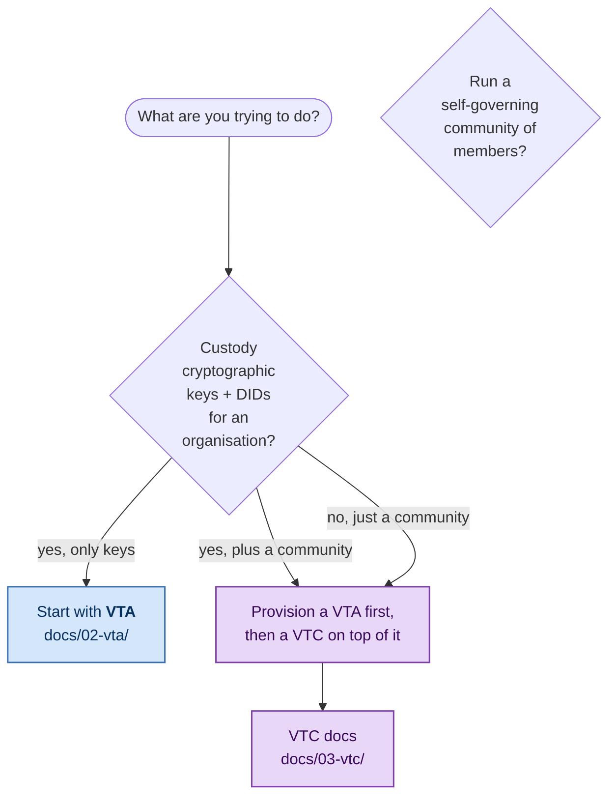
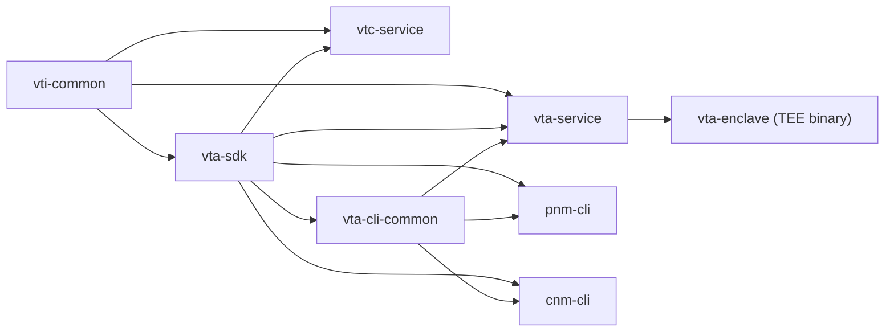

# Verifiable Trust Infrastructure

[](https://github.com/OpenVTC/verifiable-trust-infrastructure)
[](LICENSE)

A Rust workspace implementing the two service backends of the
[First Person Network](https://www.firstperson.network/white-paper):

- **Verifiable Trust Agent (VTA)** — manages cryptographic keys, DIDs,
  and access-control policies for a single organisational identity.
- **Verifiable Trust Community (VTC)** — manages a community of
  members, their credentials, the policies that gate them, and the
  optional public website + admin UX.

Plus the CLIs, SDKs, and shared crates that compose them.

## Which service do you need?



A VTC always sits **on top of** a VTA: the VTA mints the VTC's
keys at first boot via the `vtc-host` DID template (`vtc setup`
drives the provision-integration flow against the VTA). One VTA can
host many VTCs.

## Workspace layout



Dependencies flow strictly downward — no cycles.

| Crate | Role |
|---|---|
| **vti-common** | Shared foundation: JWT auth, ACL, `Store`/`KeyspaceHandle`, error types, config, telemetry sink, audit envelopes. |
| **vta-sdk** | Public SDK: types, REST + DIDComm client, sealed-transfer, DID-template engine, attestation verification. |
| **vta-cli-common** | Shared CLI command implementations used by both `pnm` and `cnm`. |
| **vta-service** | VTA library + local/dev binary (`vta`). Routes, operations, setup wizards, DIDComm protocol management. |
| **vta-enclave** | VTA binary for AWS Nitro Enclaves (TEE bootstrap, KMS, vsock-store, attestation). Linux-only. |
| **vtc-service** | VTC binary (`vtc`) — community lifecycle, policies, credentials, public website, admin UX. |
| **pnm-cli** | Personal Network Manager — single-VTA operator CLI (`pnm`). |
| **cnm-cli** | Community Network Manager — multi-community operator CLI (`cnm`). |
| **didcomm-test** | Standalone DIDComm connectivity test harness. Not published. |

## Quick start

**Build the workspace:**

```sh
cargo build --workspace
```

**Pick a path:**

| If you need… | Start at |
|---|---|
| A new VTA from scratch | [`docs/02-vta/cold-start.md`](docs/02-vta/cold-start.md) |
| A VTA inside a Nitro Enclave | [`docs/02-vta/tee-architecture.md`](docs/02-vta/tee-architecture.md) |
| A new VTC on an existing VTA | [`docs/03-vtc/getting-started.md`](docs/03-vtc/getting-started.md) |
| To integrate an app against a VTA | [`docs/02-vta/integration-guide.md`](docs/02-vta/integration-guide.md) |
| To understand the architecture | [`docs/01-concepts/overview.md`](docs/01-concepts/overview.md) |

## Documentation

The documentation tree is split by audience:

- **[docs/README.md](docs/README.md)** — full index with topic search.
- **[docs/01-concepts/](docs/01-concepts/)** — shared concepts that
  apply to both VTA and VTC (overview, architecture, security model,
  sealed-transfer).
- **[docs/02-vta/](docs/02-vta/)** — VTA operator + integrator
  documentation (cold-start, secret backends, TEE deployment, DIDComm,
  provision-integration, runtime service management).
- **[docs/03-vtc/](docs/03-vtc/)** — VTC operator + integrator
  documentation (getting started, community lifecycle, credentials,
  trust-registry, website, admin UX).
- **[docs/04-reference/](docs/04-reference/)** — reference material
  (BIP-32 paths, CLI conventions).
- **[docs/05-design-notes/](docs/05-design-notes/)** — design
  history and implementation notes (including the VTC MVP spec).
- **[First Person Project White Paper](https://www.firstperson.network/white-paper)**
  — the broader research context.

## Repository structure

| Path | Contents |
|---|---|
| `vti-common/`, `vta-sdk/`, `vta-cli-common/`, `vta-service/`, `vta-enclave/`, `vtc-service/` | Service + library crates (see the layout diagram above). |
| `pnm-cli/`, `cnm-cli/`, `didcomm-test/` | Binary crates. |
| `docs/` | Documentation tree (this section). |
| `trust-tasks/` | Trust Task spec + schema files. Every wire op binds to a versioned task; the `index.json` manifest lists all of them. |
| `deploy/nitro/` | Nitro Enclave deployment scaffolding. |
| `tests/` | End-to-end workspace tests. |
| `tasks/` | Phase planning documents (internal). |

## Prerequisites

- **Rust 1.95.0+** (edition 2024).
- For the default `keyring` secret backend: platform credential
  manager (macOS Keychain, Linux secret-service, Windows Credential
  Manager). Alternatives: AWS / GCP / Azure / HashiCorp Vault /
  KMS-TEE — see [`docs/02-vta/secret-backends.md`](docs/02-vta/secret-backends.md).

## Contributing

See [`CONTRIBUTING.md`](CONTRIBUTING.md). Workspace-wide design
principles live in [`CLAUDE.md`](CLAUDE.md); each crate has its own
`CLAUDE.md` with crate-scoped guidance.

## License

Apache-2.0. See [`LICENSE`](LICENSE).
