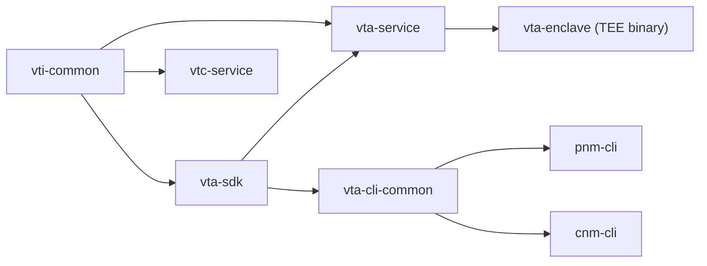

# Verifiable Trust Communities - Verified Trust Agent

[](https://github.com/OpenVTC/verifiable-trust-infrastructure)
[](LICENSE)

A Verifiable Trust Agent (VTA) is an always-on service that manages cryptographic
keys, DIDs, and access-control policies for a
[Verifiable Trust Community](https://www.firstperson.network/white-paper). This
repository contains the VTA service, a shared SDK, and the Community Network
Manager (CNM) CLI.

## Table of Contents

- [Overview](#overview)
- [Architecture](#architecture)
- [Prerequisites](#prerequisites)
- [Getting Started](#getting-started)
- [Example: Creating a New Application Context](#example-creating-a-new-application-context)
- [Additional Resources](#additional-resources)

## Overview

The repository is a Rust workspace:

| Crate               | Description                                                                                             |
| -------------------- | ------------------------------------------------------------------------------------------------------- |
| **vta-service**      | VTA library and local/dev binary. Manages keys, contexts, ACL, sessions, DIDComm, and backup/restore.   |
| **vta-enclave**      | VTA binary for AWS Nitro Enclaves (TEE bootstrap, KMS, vsock-store, attestation).                       |
| **vta-sdk**          | Shared SDK: types, VTA HTTP/DIDComm client, session/auth logic, and protocol constants.                 |
| **vti-common**       | Shared foundation: auth, ACL, store abstraction (local + vsock), error types, config.                   |
| **vta-cli-common**   | Shared CLI command implementations used by both pnm-cli and cnm-cli.                                    |
| **cnm-cli**          | Community Network Manager CLI -- multi-community client for operating VTAs.                              |
| **pnm-cli**          | Personal Network Manager CLI -- single-VTA client for personal use.                                      |
| **vtc-service**      | Verifiable Trust Community service.                                                                      |
| **didcomm-test**     | Standalone DIDComm connectivity test harness.                                                            |

### Crate Dependencies



## Architecture

The VTA is built on Axum with an embedded fjall key-value store for
persistence. Cryptographic keys derive from a single BIP-39 mnemonic via
BIP-32 Ed25519 derivation, and the master seed is stored in a pluggable
backend (OS keyring by default; see [Feature Flags](#feature-flags)). Authentication uses a DIDComm v2 challenge-response flow
that issues short-lived EdDSA JWTs.

| Layer          | Technology                                                                                                |
| -------------- | --------------------------------------------------------------------------------------------------------- |
| Web framework  | Axum 0.8                                                                                                  |
| Async runtime  | Tokio                                                                                                     |
| Storage        | fjall (embedded LSM key-value store)                                                                      |
| Cryptography   | ed25519-dalek, ed25519-dalek-bip32                                                                        |
| DID resolution | affinidi-did-resolver-cache-sdk                                                                           |
| DIDComm        | affinidi-tdk (didcomm, secrets_resolver)                                                                  |
| JWT            | jsonwebtoken (EdDSA / Ed25519)                                                                            |
| Seed storage   | OS keyring, AWS Secrets Manager, GCP Secret Manager, or config file (see [Feature Flags](#feature-flags)) |

See [docs/design.md](docs/design.md) for the full design document.

See [Feature Flags](docs/feature-flags.md) for compile-time feature configuration.

## Prerequisites

- **Rust 1.91.0+** (edition 2024)
- **OS keyring support** (when using the default `keyring` feature) --
  the master seed is stored in your platform's credential manager:
  - macOS: Keychain
  - Linux: secret-service (e.g. GNOME Keyring)
  - Windows: Credential Manager

## Getting Started

### Build

```sh
cargo build --workspace
```

### Run the Setup Wizard

The setup wizard bootstraps a new VTA instance. It is behind the `setup`
feature flag:

```sh
# Interactive
cargo run --package vta-service --features setup -- setup

# Non-interactive (CI / sealed images / unattended bootstrap)
cargo run --package vta-service --features setup -- setup --from setup.toml
```

See [`docs/non-interactive-setup.md`](docs/non-interactive-setup.md) and
[`docs/examples/vta-setup.example.toml`](docs/examples/vta-setup.example.toml)
for the `--from` schema.

The wizard walks through these steps:

1. **Server configuration** -- host, port, log level, data directory.
2. **Seed context** -- creates the `vta` context (and `mediator` if DIDComm
   is enabled).
3. **Mnemonic** -- generates a fresh BIP-39 mnemonic; the derived seed is
   stored in the chosen backend (OS keyring by default). Pasting an
   existing mnemonic is intentionally not offered -- run
   `vta keys rotate-seed --mnemonic "<your 24 words>"` after setup if you
   need to import a known seed.
4. **JWT signing key** -- a random Ed25519 key for signing access tokens.
5. **Mediator DID** -- creates a `did:webvh` with signing and key-agreement
   keys.
6. **VTA DID** -- creates a `did:webvh` with a DIDComm service endpoint
   pointing to the mediator.
7. **Admin credential** -- generates a `did:key` credential for the first
   administrator.
8. **ACL bootstrap** -- registers the admin in the access-control list.
9. **Persist** -- writes `config.toml` and flushes the store.

> **Save the mnemonic and admin credential.** The mnemonic is the root of
> all key material; the admin credential is required to authenticate the
> CLI. After the first admin connects, run `pnm backup export` to capture
> an encrypted backup of both.

### Start the VTA Service

```sh
cargo run --package vta-service
```

The service listens on the host and port configured during setup (default
`127.0.0.1:3000`). Verify it is running:

```sh
# Using the Community Network Manager (multi-community):
cargo run --package cnm-cli -- health

# Or using the Personal Network Manager (single VTA):
cargo run --package pnm-cli -- health --url http://localhost:3000
```

### Authenticate a CLI

Use the admin credential printed during setup:

```sh
# CNM -- multi-community, interactive setup
cargo run --package cnm-cli -- auth login <credential>

# PNM -- single VTA, non-interactive setup
cargo run --package pnm-cli -- setup --url http://localhost:3000 --credential <credential>
```

This imports the credential into the OS keyring, performs a DIDComm
challenge-response handshake, and caches the resulting tokens. Subsequent
commands authenticate automatically.

## Example: Creating a New Application Context

The `contexts bootstrap` command creates a context and generates credentials
for its first admin in a single step:

```sh
cargo run --package cnm-cli -- contexts bootstrap \
  --id myapp \
  --name "My Application" \
  --admin-label "MyApp Admin"
```

This outputs a credential string. Give it to the context administrator so they
can authenticate:

```sh
cargo run --package cnm-cli -- auth login <context-admin-credential>
```

Follow-up commands the context admin can now run:

```sh
# List all contexts visible to this credential
cargo run --package cnm-cli -- contexts list

# Create an Ed25519 signing key in the new context
cargo run --package cnm-cli -- keys create --key-type ed25519 --context-id myapp --label "Signing Key"

# List keys
cargo run --package cnm-cli -- keys list
```

See [PNM CLI](pnm-cli/README.md) and [CNM CLI](cnm-cli/README.md) for command references.

## Documentation

- [Design Document](docs/design.md) -- architecture, API, and workspace structure
- [Security Architecture](docs/security.md) -- defense-in-depth model and threat model
- [TEE Enclave Security](docs/design/tee-enclave-security.md) -- Nitro Enclave KMS bootstrap and encrypted storage design
- [Cold-Start Guide](docs/cold-start-guide.md) -- bootstrapping a VTA + WebVH + mediator from scratch
- [Non-Interactive Setup](docs/non-interactive-setup.md) -- scripted VTA provisioning via TOML for CI / sealed images / unattended bootstrap
- [Integration Guide](docs/integration-guide.md) -- integrating a 3rd-party application with the VTA
- [DIDComm Protocol](docs/didcomm_protocol.md) -- message types, schemas, and authorization
- [BIP-32 Path Specification](docs/bip32_paths.md) -- hierarchical key derivation paths
- [Feature Flags](docs/feature-flags.md) -- Cargo feature flags and deployment profiles
- [Adding a Front-End](docs/extending.md) -- how to add a new VTA deployment binary
- [Store Migration](docs/design/store-migration.md) -- enum-to-trait migration path for storage backends
- [First Person Project White Paper](https://www.firstperson.network/white-paper)
