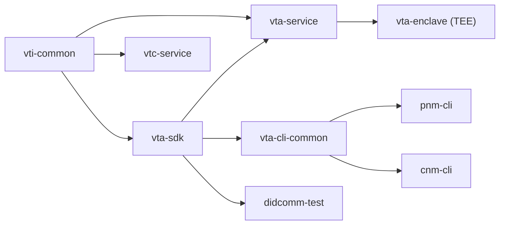

# Architecture

This chapter describes how the workspace is laid out, what each crate
is responsible for, what `vta-service` looks like inside, and how to
add a new front-end binary. For *what the system is and why* see
[`overview.md`](overview.md).

## Workspace

```
verifiable-trust-infrastructure/
  vti-common/         Shared error types, utilities, and constants
  vta-sdk/            Data model (KeyRecord, ContextRecord, protocol constants)
  vta-service/        Axum HTTP service (this chapter's focus)
  vta-enclave/        TEE enclave wrapper (Nitro Enclaves / vsock proxy)
  vtc-service/        Verifiable Trust Community service
  vta-cli-common/     Shared CLI auth, config, and HTTP helpers
  pnm-cli/            Personal Network Manager CLI
  cnm-cli/            Community Network Manager CLI
  didcomm-test/       DIDComm integration test harness
```

`vti-common` provides foundational types used across the stack. `vta-sdk`
defines the data model; both the service and CLIs depend on it so
request/response types stay in sync. `vta-cli-common` factors out shared
CLI logic (authentication, HTTP client, credential management) consumed by
both `pnm-cli` and `cnm-cli`.



## Application state

All shared state lives in `AppState` (defined in `server.rs`):

```
AppState
  store            Store                                  fjall database handle
  keys_ks          KeyspaceHandle                         "keys" partition
  sessions_ks      KeyspaceHandle                         "sessions" partition
  acl_ks           KeyspaceHandle                         "acl" partition
  contexts_ks      KeyspaceHandle                         "contexts" partition
  cache_ks         KeyspaceHandle                         "cache" partition
  config           Arc<RwLock<AppConfig>>                 runtime-mutable config
  seed_store       Arc<dyn SeedStore>                     master-seed backend (keyring, KMS, …)
  did_resolver     Option<DIDCacheClient>                 DID resolution (None before setup)
  secrets_resolver Option<Arc<ThreadedSecretsResolver>>   VTA DIDComm secrets (None before setup)
  jwt_keys         Option<Arc<JwtKeys>>                   JWT sign/verify keys (None before setup)
```

The three auth fields are `Option` so the server can start before
setup has run. When `None`, auth endpoints return an error directing
the operator to run setup first.

Keyspace handles wrap fjall partitions and expose async CRUD via
`tokio::spawn_blocking`. Structured values are JSON-serialized.

## Module map

```
vta-service/src/
  main.rs          CLI entry (run server, setup, or offline commands)
  server.rs        Router construction, AppState init, graceful shutdown
  config.rs        TOML config with env var overrides
  error.rs         AppError enum -> HTTP responses
  status.rs        `vta status` -- offline stats and health check
  setup.rs         Interactive setup wizard (feature-gated "setup")
  import_did.rs    `vta import-did` -- offline ACL entry creation
  acl_cli.rs       `vta acl` -- offline ACL list/get/update/delete
  did_key.rs       `vta create-did-key` -- offline did:key creation
  did_webvh.rs     `vta create-did-webvh` -- offline did:webvh wizard

  auth/
    jwt.rs         EdDSA JWT encode/decode, PKCS8 DER key construction
    session.rs     Session lifecycle (ChallengeSent -> Authenticated), cleanup
    credentials.rs did:key credential generation
    extractor.rs   Axum extractors: AuthClaims, ManageAuth, AdminAuth

  acl/             Role-based ACL (Admin, Initiator, Application)
  contexts/        Application context CRUD, index allocation

  keys/
    derivation.rs  BIP-32 Ed25519/X25519/P-256 derivation trait
    paths.rs       Sequential path counter allocation
    seed_store/    Master-seed backends (keyring, AWS, GCP, Azure, Vault, KMS-TEE, plaintext)

  store/           fjall wrapper (Store, KeyspaceHandle)

  messaging/
    mod.rs         DIDComm router (route by message type)
    handlers/      Per-type DIDComm message handlers

  operations/      Shared business logic reachable from both REST and DIDComm
    backup.rs      Encrypted backup export/import logic
    provision_integration.rs  Template-driven integration bootstrap

  metrics.rs       Prometheus-compatible metrics collection

  tee/
    mod.rs               TEE abstraction layer
    kms_bootstrap.rs     KMS-based seed unsealing for enclaves
    did_autogen.rs       Auto-generate VTA DID on first boot
    admin_bootstrap.rs   Admin credential bootstrap in TEE mode
    mnemonic_guard.rs    Mnemonic access policy (TEE vs. dev)

  routes/
    mod.rs         Route table
    health.rs      GET /health
    auth.rs        Challenge-response, token issue/refresh, sessions
    config.rs      GET/PATCH /config
    keys.rs        Key CRUD + signing oracle
    contexts.rs    Context CRUD
    acl.rs         ACL CRUD
    cache.rs       Token cache (GET/PUT/DELETE)
    bootstrap.rs   Sealed-transfer + provision-integration endpoints
```

## API surface

### Public

| Method | Path | Purpose |
|---|---|---|
| GET | /health | Status + version |

### Authentication

| Method | Path | Auth | Purpose |
|---|---|---|---|
| POST | /auth/challenge | None (ACL) | Request DIDComm challenge |
| POST | /auth/ | None | Submit signed challenge, get tokens |
| POST | /auth/refresh | None | Refresh access token |
| POST | /auth/credentials | Manage | Generate did:key credential |
| GET | /auth/sessions | Manage | List sessions |
| DELETE | /auth/sessions/{id} | Auth | Revoke session |
| DELETE | /auth/sessions?did=X | Admin | Revoke all sessions for a DID |

### Configuration

| Method | Path | Auth | Purpose |
|---|---|---|---|
| GET | /config | Auth | Read config |
| PATCH | /config | Super Admin | Update config |

### Keys

| Method | Path | Auth | Purpose |
|---|---|---|---|
| GET | /keys | Auth | List (filtered by context access) |
| POST | /keys | Admin | Create (context access checked) |
| GET | /keys/{key_id} | Auth | Get key record (context access checked) |
| DELETE | /keys/{key_id} | Admin | Invalidate key (context access checked) |
| PATCH | /keys/{key_id} | Admin | Rename key (context access checked) |
| GET | /keys/{key_id}/secret | Admin | Export private key material |
| POST | /keys/{key_id}/sign | Auth | Sign payload (signing oracle) |

### Cache

| Method | Path | Auth | Purpose |
|---|---|---|---|
| GET | /cache/{key} | Auth | Retrieve cached value |
| PUT | /cache/{key} | Auth | Store value with TTL |
| DELETE | /cache/{key} | Auth | Delete cached value |

### Contexts

| Method | Path | Auth | Purpose |
|---|---|---|---|
| GET | /contexts | Auth | List contexts (filtered by access) |
| POST | /contexts | Super Admin | Create context |
| GET | /contexts/{id} | Auth | Get context (access checked) |
| PATCH | /contexts/{id} | Super Admin | Update context |
| DELETE | /contexts/{id} | Super Admin | Delete context |

### ACL

| Method | Path | Auth | Purpose |
|---|---|---|---|
| GET | /acl/ | Manage | List entries |
| POST | /acl/ | Manage | Create entry |
| GET | /acl/{did} | Manage | Get entry |
| PATCH | /acl/{did} | Manage | Update entry |
| DELETE | /acl/{did} | Manage | Delete entry |

### VTA management

| Method | Path | Auth | Purpose |
|---|---|---|---|
| POST | /vta/restart | Admin | Trigger soft restart |

### Backup

| Method | Path | Auth | Purpose |
|---|---|---|---|
| POST | /backup/export | Admin | Export encrypted backup |
| POST | /backup/import | Admin | Import encrypted backup |

### Bootstrap

| Method | Path | Auth | Purpose |
|---|---|---|---|
| POST | /bootstrap/request | None (rate-limited) | TEE Mode B sealed first-boot |
| POST | /bootstrap/provision-integration | Admin | Template-driven integration bootstrap |
| GET | /did/{did}/log | None (rate-limited) | Public webvh `did.jsonl` retrieval |

Auth levels: **Auth** = any valid JWT, **Manage** = Admin or
Initiator, **Admin** = Admin role only, **Super Admin** = Admin with
empty `allowed_contexts`.

## Storage layout

All data lives in fjall keyspaces:

| Keyspace | Key Pattern | Value |
|---|---|---|
| keys | `key:{key_id}` | KeyRecord (JSON) |
| keys | `path_counter:{base_path}` | u32 (LE bytes) |
| sessions | `session:{session_id}` | Session (JSON) |
| sessions | `refresh:{token}` | session_id bytes |
| acl | `acl:{did}` | AclEntry (JSON) |
| contexts | `ctx:{id}` | ContextRecord (JSON) |
| contexts | `ctx_counter` | u32 (LE bytes) |
| cache | `cache:{did}:{key}` | CacheEntry (JSON) |

In TEE deployments the `Store` enum dispatches transparently to a
`VsockStore` running on the parent EC2 instance instead of a local
fjall handle. See [`tee-architecture.md`](tee-architecture.md).

## VTA CLI

The `vta` binary serves as both the HTTP server (when run without a
subcommand) and a set of offline management commands that operate
directly on the store:

```
vta                                     Start the HTTP service
vta setup [--from FILE]                 Setup wizard (interactive or TOML-driven)
vta status                              Show config, contexts, keys, ACL, sessions
vta config show                         Print VTA identity / service settings
vta export-admin                        Export admin DID and credential
vta bootstrap-admin --did DID           Seed first super-admin and seal the VTA
vta create-did-key --context ID         Create a did:key in a context
vta create-did-webvh --context ID       Create a did:webvh interactively
vta import-did --did DID [--role ...]   Import external DID into ACL
vta acl list / get / update / delete    ACL management
vta keys list / secrets / seeds / rotate-seed   Key + seed management

# Sealed-transfer bootstrap (consumer side — cold-start without pnm)
vta bootstrap request --out FILE [--label TEXT] [--seed-dir PATH]
vta bootstrap open    --bundle FILE --expect-digest HEX [--seed-dir PATH]

# Sealed-transfer bootstrap (producer side — VTA host)
vta bootstrap seal                  --request REQ --payload PAYLOAD --out BUNDLE
vta bootstrap provision-integration --request REQ --context ID      --out BUNDLE
```

For PNM and CNM CLI references, see
[`pnm-cli/README.md`](../../pnm-cli/README.md) and
[`cnm-cli/README.md`](../../cnm-cli/README.md).

## Setup wizard

Running `vta setup` launches the wizard. Interactive by default;
`vta setup --from <file>` reads a TOML inputs file and runs end-to-end
without prompts (CI / sealed images / unattended bootstrap — see
[`02-operating/non-interactive-setup.md`](../02-operating/non-interactive-setup.md)).

1. Collect server, logging, and storage configuration.
2. Create the `vta` seed context (and `mediator` if DIDComm is enabled).
3. Generate a fresh BIP-39 mnemonic; store seed in the chosen backend
   (OS keyring by default — see
   [`02-operating/secret-backends.md`](../02-operating/secret-backends.md)).
   The wizard does not accept an operator-supplied mnemonic — pasting
   one into a terminal exposes it to history, scrollback, and clipboard.
   Use `vta keys rotate-seed --mnemonic "<phrase>"` post-setup if a
   known seed is required.
4. Generate a random JWT signing key.
5. Create mediator did:webvh (signing + key-agreement keys, DID log file).
6. Create VTA did:webvh with DIDComm service pointing to the mediator.
7. Create admin identity (did:key credential, did:webvh, or existing DID).
8. Bootstrap ACL with admin entry.
9. Persist store and write `config.toml`.

The wizard is feature-gated behind `"setup"` so production builds can
exclude the dialoguer dependency.

## Adding a new front-end

The VTA is designed as a **core library + thin front-ends**
architecture. The business logic (routes, operations, keys, auth,
store) lives in the `vta-service` library crate. Each deployment
mode has its own binary crate that handles platform-specific
bootstrapping and calls `server::run()`.

### Current front-ends

| Crate | Binary | Purpose |
|-------|--------|---------|
| `vta-service` | `vta` | Local/dev/cloud — opens a local fjall store, no TEE |
| `vta-enclave` | `vta-enclave` | AWS Nitro Enclave — KMS bootstrap, vsock store, TEE attestation |

### 1. Create the crate

```
mkdir vta-myfrontend
```

**`vta-myfrontend/Cargo.toml`:**

```toml
[package]
name = "vta-myfrontend"
version.workspace = true
edition.workspace = true

[[bin]]
name = "vta-myfrontend"
path = "src/main.rs"

[features]
default = ["rest", "didcomm"]
rest = ["vta-service/rest"]
didcomm = ["vta-service/didcomm"]

[dependencies]
vta-service = { path = "../vta-service" }
tokio = { workspace = true }
tracing = { workspace = true }
```

Add it to the workspace in `Cargo.toml`:

```toml
[workspace]
members = [
  # ... existing crates ...
  "vta-myfrontend",
]
```

### 2. Write the main.rs

A minimal front-end is ~30 lines:

```rust
use std::sync::Arc;
use vta_service::config::AppConfig;
use vta_service::keys::seed_store::create_seed_store;
use vta_service::store::Store;

#[tokio::main]
async fn main() {
    let config = AppConfig::load(None).expect("failed to load config");
    vta_service::init_tracing(&config);

    let store = Store::open(&config.store).expect("failed to open store");
    let seed_store = Arc::from(
        create_seed_store(&config).expect("failed to create seed store"),
    );

    if let Err(e) = vta_service::server::run(
        config,
        store,
        seed_store,
        None, // storage_encryption_key
        None, // tee_context
    )
    .await
    {
        tracing::error!("server error: {e}");
        std::process::exit(1);
    }
}
```

### 3. What you can customize

The entry point `server::run()` accepts five parameters:

| Parameter | Type | Purpose |
|-----------|------|---------|
| `config` | `AppConfig` | Loaded from TOML + env var overrides |
| `store` | `Store` | `Store::Local(...)` for fjall, `Store::Vsock(...)` for vsock proxy |
| `seed_store` | `Arc<dyn SeedStore>` | Where the master seed lives — see [`secret-backends.md`](../02-operating/secret-backends.md) |
| `storage_encryption_key` | `Option<[u8; 32]>` | AES-256-GCM key for at-rest encryption (None = unencrypted) |
| `tee_context` | `Option<TeeContext>` | TEE attestation provider + mnemonic guard (None = no TEE) |

Your front-end's job is to **construct these values** using whatever
platform-specific logic your environment needs, then call
`server::run()`.

### 4. Common patterns

**Custom store backend:** Implement a `VsockStore`-like adapter (or
add a new variant to the `Store` enum in
`vti-common/src/store/mod.rs`).

**Custom seed storage:** Implement the `SeedStore` trait from
`vti_common::seed_store`. Examples in `vta-service/src/keys/seed_store/`:
`PlaintextSeedStore`, `KeyringSeedStore`, `KmsTeeSeedStore`,
`VaultSeedStore`.

**Custom TEE provider:** Implement the `TeeProvider` trait from
`vta-service/src/tee/provider.rs`. Pass it wrapped in a `TeeContext`
to `server::run()`. The server uses it for attestation endpoints and
JWT claims.

**Disable features:** Use `--no-default-features` and enable only what
you need. For example, a DIDComm-only deployment:

```toml
[dependencies]
vta-service = { path = "../vta-service", default-features = false, features = ["didcomm"] }
```

### 5. Examples

- **`vta-service/src/main.rs`** — Simplest front-end. Opens local
  store, creates seed store, calls `server::run()`. No TEE, no
  encryption.

- **`vta-enclave/src/main.rs`** — Full TEE front-end. VsockStore
  connection, KMS bootstrap, mnemonic guard, DID auto-generation,
  TEE provider init. ~170 lines of bootstrap code. See
  [`tee-architecture.md`](tee-architecture.md) for the design.
