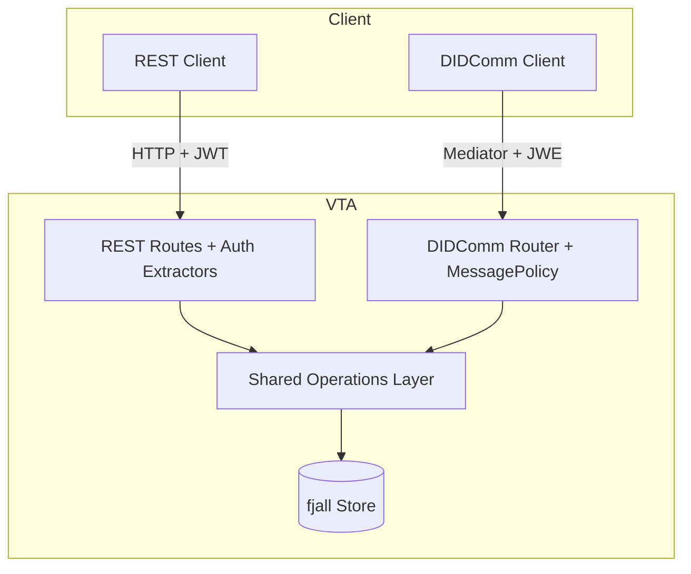

# Overview

The Verifiable Trust Infrastructure (VTI) is a Rust workspace that
implements the Verifiable Trust Agent (VTA) and its surrounding tooling.
A VTA manages cryptographic keys, DIDs, and access control for a
Verifiable Trust Community as part of the
[First Person Network](https://www.firstperson.network/white-paper).

This chapter explains *what the system is* and the concepts you need
to navigate the rest of this book. For workspace shape and how the
code is organized, see [`architecture.md`](architecture.md).

## What a VTA does

A VTA is the custody root for a community's cryptographic identity.
It holds a single BIP-39 master seed and derives every other key —
DIDs, signing keys, key-agreement keys, sealed-transfer assertion
keys — from that seed via BIP-32 paths. Operators interact with the
VTA through:

- **REST** for synchronous management calls (HTTPS + JWT).
- **DIDComm v2** for end-to-end-encrypted messaging mediated through
  a DIDComm mediator.
- **Local CLI** for offline operations on the on-disk store (setup,
  sealed-transfer bootstrap, forensic inspection).

A VTA is not a vault, a wallet, or a CA in the classical sense. It is
a **signing oracle with policy** — clients send unsigned payloads, the
VTA derives the relevant key, signs in memory, and returns the
signature. Private key material never leaves the VTA's process.

## Core concepts

### Contexts

A *context* is a logical grouping of keys and DIDs (e.g. `vta`,
`mediator`, `webvh-host`, `prod-app`). Each context has:

- A slug ID (`vta`, `mediator`, …) and a display name.
- A BIP-32 base path (`m/26'/2'/N'`) allocated at creation time and
  immutable thereafter.
- A monotonic key counter so every key in the context has a unique
  sequential index.
- An optional DID assigned to the context after the corresponding
  DID is minted.

Three contexts are seeded during setup. New contexts are added via
`POST /contexts` (super-admin only) and receive the next available
index.

See [`bip32-paths.md`](../04-reference/bip32-paths.md) for the full
derivation specification.

### DIDs and key types

| Method | Use | Notes |
|---|---|---|
| `did:key` | Application credentials, ephemeral bootstrap identities | Self-resolving from a multibase Ed25519 pubkey. |
| `did:webvh` | Production identifiers for the VTA, mediator, and organizational entities | Self-certifying SCID; portable across hosts; pre-rotation; signed `did.jsonl` history. |

Key cryptography is uniform across both methods:

- **Ed25519** — signing, authentication, assertion (multibase prefix `z6Mk`).
- **X25519** — Diffie-Hellman key agreement, derived from the Ed25519
  private key via clamping (multibase prefix `z6LS`).
- **P-256** — ECDSA signing (ES256), used for PAT JWT signing and
  other surfaces that need a NIST curve. Derived via HMAC-SHA512
  domain separation from BIP-32 path material.

### Roles and authorization

ACL entries grant a DID one of three roles:

| Role | Capabilities |
|---|---|
| Admin | Full access; unrestricted when `allowed_contexts` is empty |
| Initiator | Manage ACL entries and view resources |
| Application | Read-only access to keys, contexts, config |

The Admin role has two tiers based on `allowed_contexts`:

| Type | `allowed_contexts` | Access |
|---|---|---|
| Super admin | `[]` (empty) | Unrestricted |
| Context admin | `["vta", …]` | Keys and ACL within assigned contexts only |

No additional role values exist. The super-admin distinction is
purely whether the context list is empty.

Context-scoped users see a filtered view: `GET /contexts`,
`GET /keys`, and `GET /acl/` only return resources whose context lies
inside `allowed_contexts`. Privilege escalation is prevented by
refusing to grant access to contexts the caller doesn't already
hold, and by refusing to create ACL entries with empty
`allowed_contexts` from a context-scoped session.

For the full threat model and defence-in-depth analysis, see
[`security-model.md`](security-model.md).

### Authentication

Authentication is a DIDComm-style challenge-response, regardless of
transport:

```
Client -> POST /auth/challenge {did}                  (or DIDComm equivalent)
VTA    -> {session_id, challenge}
Client -> sign challenge with DID private key
Client -> POST /auth/  (signed challenge envelope)
VTA    -> {access_token, refresh_token}               (15min / 24h defaults)
```

The JWT is signed with an Ed25519 key (PKCS8 v1 DER) stored in the
config file. Sessions progress through `ChallengeSent` → `Authenticated`
and are cleaned up by a background sweeper.

DIDComm steady-state authentication is *authcrypt-as-auth*: the
inbound message's `from` is verified by the DIDComm authcrypt
unwrap, and the ACL is checked directly. No separate JWT is issued
on the DIDComm path.

### Sealed-transfer envelopes

Every secret-bearing wire format in VTI uses the same sealed-transfer
envelope: HPKE (X25519-HKDF-SHA256 KEM, ChaCha20-Poly1305 AEAD)
encrypted to a recipient's `did:key`, framed in OpenPGP-style ASCII
armor with an out-of-band SHA-256 digest acting as the integrity
anchor. Producer assertion is one of `DidSigned`, `Attested` (Nitro
attestation), or `PinnedOnly` (dev/test).

Bootstrap, context handoff, key bundles, and provision-integration
all share this envelope. The CLI exposes it as `vta bootstrap …` and
`pnm bootstrap …` commands.

See [`provision-integration.md`](../03-integrating/provision-integration.md)
for the canonical flow that uses sealed transfer end-to-end.

## Technology stack

| Layer | Choice |
|---|---|
| Web framework | Axum 0.8 |
| Async runtime | Tokio |
| Storage | fjall (embedded LSM key-value store) |
| Cryptography | ed25519-dalek, ed25519-dalek-bip32, p256 |
| DID resolution | affinidi-did-resolver-cache-sdk |
| DIDComm | affinidi-tdk (didcomm, secrets_resolver) |
| JWT | jsonwebtoken (EdDSA / Ed25519) |
| Master-seed storage | OS keyring by default; AWS / GCP / Azure / HashiCorp Vault / KMS-TEE via feature flags |

For backend selection and configuration, see
[`secret-backends.md`](../02-operating/secret-backends.md).

## Request flow

REST and DIDComm converge on the same shared operations layer:



The duplication is intentional: the same operation (create a key,
register an ACL entry, provision an integration) is reachable from
either transport, with a single library function as the source of
truth.

## Where to go next

- **Setting up your first VTA?** Start with
  [`02-operating/cold-start.md`](../02-operating/cold-start.md).
- **Picking a secret-storage backend?** See
  [`02-operating/secret-backends.md`](../02-operating/secret-backends.md).
- **Building an integration on top of a VTA?** Start with
  [`03-integrating/integration-guide.md`](../03-integrating/integration-guide.md).
- **Looking at the workspace layout?** See
  [`architecture.md`](architecture.md).
- **Planning a TEE deployment?** See
  [`tee-architecture.md`](tee-architecture.md).
