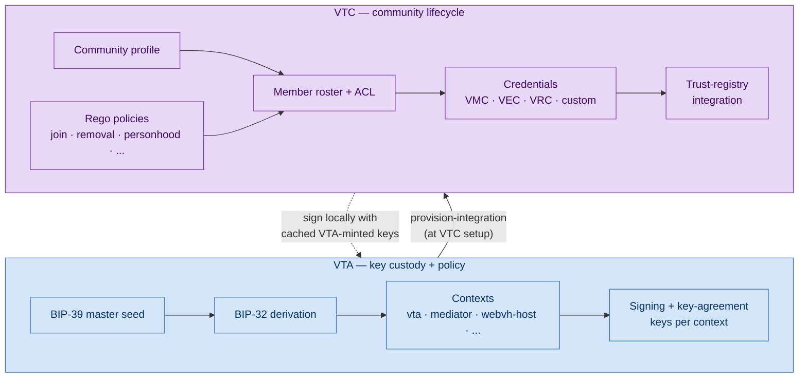
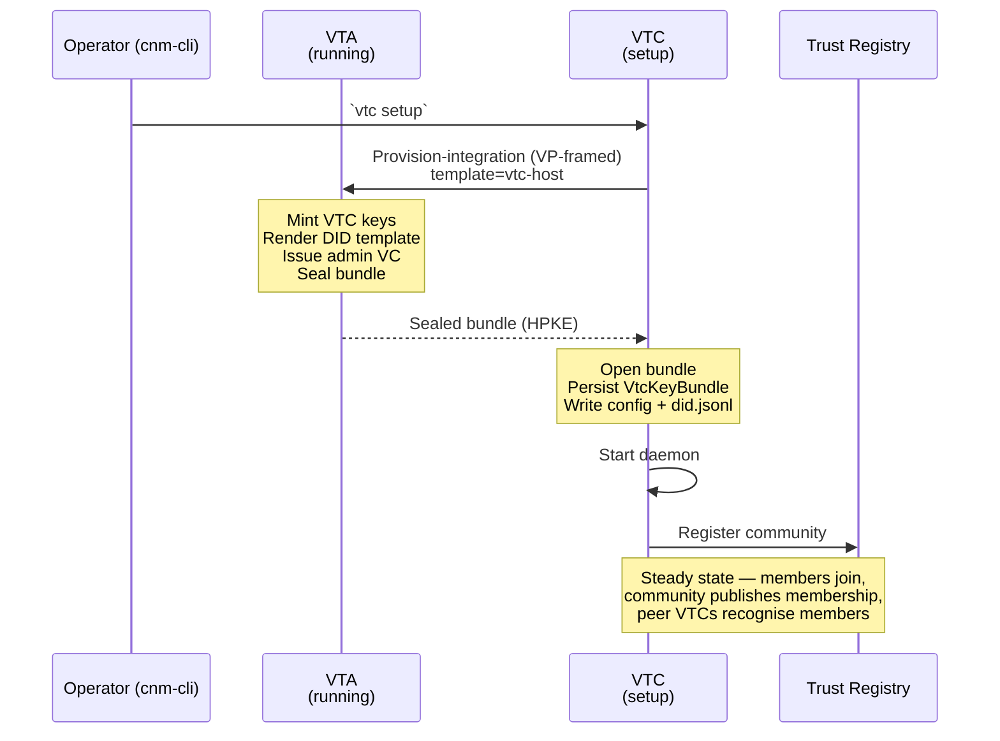
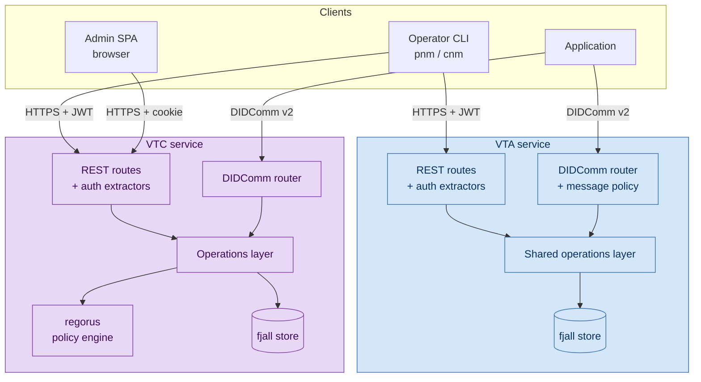

# Overview

The Verifiable Trust Infrastructure (VTI) is a Rust workspace that
implements the two service backends of the
[First Person Network](https://www.firstperson.network/white-paper):
the **Verifiable Trust Agent (VTA)** and the **Verifiable Trust
Community (VTC)**. Together they let a real-world community manage
its own identity, keys, members, credentials, and policies without
trusting a centralised platform.

This chapter explains *what each service is* and the concepts you
need to navigate the rest of this book. For workspace shape and how
the code is organised, see [`architecture.md`](architecture.md).

## VTA + VTC at a glance



| | **VTA** | **VTC** |
|---|---|---|
| Owns | BIP-39 master seed, every derived key | A community's members, policies, credentials |
| Mints keys | Yes — the canonical issuer | No — receives a key bundle from a VTA at setup |
| Holds keys | Yes, in memory + persisted store | Yes, cached locally for signing |
| Persistent storage | fjall keyspaces under the VTA data dir | fjall keyspaces under the VTC data dir |
| Default port | 8100 | 8200 |
| JWT audience | `aud: "VTA"` | `aud: "VTC"` (cross-audience tokens rejected) |
| TEE deployment | Yes — `vta-enclave` for AWS Nitro | **Never** — permanent non-goal (VTC spec §3-K) |

## What the VTA does

A VTA is the custody root for an organisation's cryptographic
identity. It holds a single BIP-39 master seed and derives every
other key — DIDs, signing keys, key-agreement keys, sealed-transfer
assertion keys — from that seed via BIP-32 paths. Operators interact
with the VTA through:

- **REST** for synchronous management calls (HTTPS + JWT).
- **DIDComm v2** for end-to-end-encrypted messaging mediated through
  a DIDComm mediator.
- **Local CLI** for offline operations on the on-disk store (setup,
  sealed-transfer bootstrap, forensic inspection).

A VTA is not a vault, a wallet, or a CA in the classical sense. It
is a **signing oracle with policy** — clients send unsigned
payloads, the VTA derives the relevant key, signs in memory, and
returns the signature. Private key material never leaves the VTA's
process.

For deep dives:

- [VTA cold-start](../02-vta/cold-start.md) — bootstrap a fresh
  VTA.
- [Provision-integration](../02-vta/provision-integration.md) —
  the canonical flow for standing up mediators, webvh-hosts, and
  apps via DID templates and sealed-transfer.
- [TEE architecture](../02-vta/tee-architecture.md) — Nitro Enclave
  deployment.

## What the VTC does

A VTC is a **self-governing community service**. It sits on top of
an already-running VTA (one VTA can host many VTCs) and manages:

- **Membership** — ACL + member roster + join requests + removal
  dispositions.
- **Policy** — embedded `regorus` (in-process Rego evaluator) that
  decides join admission, removal terms, personhood assertion,
  endorsement issuance.
- **Credentials** — issues W3C Verifiable Membership Credentials
  (VMC), Verifiable Endorsement Credentials (VEC), Verifiable
  Relationship Credentials (VRC), and operator-defined custom
  endorsements. Each credential carries a Bitstring Status List
  index for revocation.
- **Trust-registry integration** — publishes membership to a
  TRQP-compatible trust registry, drives the `MembershipSyncer`
  reconciliation loop, recognises members of peer communities for
  cross-community session minting.
- **Public website** — optional filesystem-backed static hosting
  for the community's public face, with live and managed deploy
  modes.
- **Admin UX** — embedded SPA shell at `/admin/*` for operator
  management.

The VTC does **not** mint its own keys — the VTA's
provision-integration flow mints the VTC's identity at setup and
hands over a sealed bundle. The VTC keeps a cached working copy of
those keys for local signing (every VMC, VEC, status-list
credential, install-token JWT, and DIDComm outbound message is
signed in-process).

For deep dives:

- [VTC getting started](../03-vtc/getting-started.md) — quick path
  from "I have a VTA" to "members can join my community".
- [VTC architecture](../03-vtc/architecture.md) — module layout +
  keyspaces.
- [Community lifecycle](../03-vtc/community-lifecycle.md) —
  member CRUD, join, removal, policies.

## How they fit together



The handshake at the top is one-shot: after the VTC has its
`VtcKeyBundle`, it operates independently. The VTA stays online so
operators can rotate keys, manage additional integrations, and so
the VTC can call back for key rotation if it ever needs to.

## Core concepts

### Contexts (VTA-only)

A *context* is a logical grouping of keys and DIDs in the VTA. Each
context has a slug ID, a BIP-32 base path allocated at creation
time, and a monotonic key counter. See
[BIP-32 paths](../04-reference/bip32-paths.md) for the full
derivation specification.

The VTC has no contexts — it operates on a community-scoped basis
rather than a context-scoped one. The VTC's identity lives in a
single context inside the VTA (the one the `vtc-host` template
created at setup).

### DIDs and key types

| Method | Use | Notes |
|---|---|---|
| `did:key` | Application credentials, ephemeral bootstrap identities, member identities inside a VTC | Self-resolving from a multibase Ed25519 pubkey. |
| `did:webvh` | Production identifiers for the VTA, mediator, and organisational entities (including the VTC) | Self-certifying SCID; portable across hosts; pre-rotation; signed `did.jsonl` history. |

Key cryptography is uniform across both methods:

- **Ed25519** — signing, authentication, assertion (multibase prefix `z6Mk`).
- **X25519** — Diffie-Hellman key agreement, derived from the
  Ed25519 private key via clamping (multibase prefix `z6LS`).
- **P-256** — ECDSA signing (ES256), used for PAT JWT signing and
  surfaces that need a NIST curve. Derived via HMAC-SHA512 domain
  separation from BIP-32 path material.

### Roles and authorization

#### VTA roles

| Role | Capabilities |
|---|---|
| Admin | Full access; unrestricted when `allowed_contexts` is empty |
| Initiator | Manage ACL entries and view resources |
| Application | Read-only access to keys, contexts, config |

The Admin role has two tiers: super admin (`allowed_contexts == []`,
unrestricted) and context admin (scoped to listed contexts).

#### VTC roles

| Role | Capabilities |
|---|---|
| Admin | Full access; manage policies, ACL, profile, website, admin UX |
| Moderator | Approve / reject join requests, remove members |
| Issuer | Issue custom endorsements via the operator-uploaded type registry |
| Member | Self-issue VRCs, present personhood evidence, manage own DID |

A super-admin VTC role exists when the JWT's `allowed_contexts ==
[]` (mirroring the VTA pattern).

For the full threat model and defence-in-depth analysis, see
[`security-model.md`](security-model.md).

### Authentication

Both services use the same DIDComm-style challenge-response,
regardless of transport:

```
Client -> POST /auth/challenge {did}                  (or DIDComm equivalent)
Server -> {session_id, challenge}
Client -> sign challenge with DID private key
Client -> POST /auth/  (signed challenge envelope)
Server -> {access_token, refresh_token}               (15min / 24h defaults)
```

The JWT is signed with an Ed25519 key. Sessions progress through
`ChallengeSent` → `Authenticated` and are cleaned up by a background
sweeper.

**Audience isolation** is load-bearing: VTA-audience tokens cannot
authenticate against VTC routes and vice versa, even if both
services share the same operator. Phase 5 also adds an admin cookie
session for the VTC's `/admin/*` SPA — see
[`docs/03-vtc/website-and-admin.md`](../03-vtc/website-and-admin.md).

DIDComm steady-state authentication is *authcrypt-as-auth*: the
inbound message's `from` is verified by the DIDComm authcrypt
unwrap, and the ACL is checked directly. No separate JWT is issued
on the DIDComm path.

### Sealed-transfer envelopes

Every secret-bearing wire format in VTI uses the same sealed-transfer
envelope: HPKE (X25519-HKDF-SHA256 KEM, ChaCha20-Poly1305 AEAD)
encrypted to a recipient's `did:key`, framed in OpenPGP-style ASCII
armor with an out-of-band SHA-256 digest acting as the integrity
anchor. Producer assertion is one of `DidSigned`, `Attested`
(Nitro attestation), or `PinnedOnly` (dev/test).

Bootstrap, context handoff, key bundles, and provision-integration
all share this envelope. The CLI exposes it as `vta bootstrap …`
and `pnm bootstrap …` commands.

See [`provision-integration.md`](../02-vta/provision-integration.md)
for the canonical flow that uses sealed transfer end-to-end.

### Trust Tasks

Every wire op (REST endpoint or DIDComm message type) is bound to
a versioned **Trust Task** identified by a URL on
[trusttasks.org](https://trusttasks.org):

```
https://trusttasks.org/{org}/{domain}/{path}/{major}.{minor}
```

Example: `https://trusttasks.org/openvtc/vta/keys/sign/1.0` or
`https://trusttasks.org/openvtc/vtc/members/personhood/assert/1.0`.

For REST, the `Trust-Task` request header is exact-matched against
the handler's registered task URL at attach time. For DIDComm, the
message `type` field **is** the Trust Task URL. The
`trust-tasks/index.json` manifest enumerates every task the
workspace publishes. The VTA contributes the `openvtc/vta/...`
tasks; the VTC contributes the `openvtc/vtc/...` tasks.

## Technology stack

| Layer | Choice |
|---|---|
| Web framework | Axum 0.8 |
| Async runtime | Tokio |
| Storage | fjall (embedded LSM key-value store) |
| Cryptography | ed25519-dalek, ed25519-dalek-bip32, hpke (X25519 + ChaCha20-Poly1305), aws-lc-rs (KMS CMS) |
| DID resolution | affinidi-did-resolver-cache-sdk |
| DIDComm | affinidi-tdk 0.7, affinidi-messaging-didcomm-service |
| JWT | jsonwebtoken (EdDSA / Ed25519) |
| VC / VP | affinidi-vc, affinidi-data-integrity (eddsa-jcs-2022) |
| Status lists | affinidi-status-list (Bitstring Status List v1.0) |
| Policy engine | regorus (embedded Rego) — VTC only |
| Trust registry | TRQP v2.0 — VTC only |
| Master-seed storage | OS keyring (default), AWS / GCP / Azure / HashiCorp Vault / KMS-TEE |

For backend selection and configuration, see
[`secret-backends.md`](../02-vta/secret-backends.md).

## Request flow

Both VTA and VTC follow the same pattern: REST and DIDComm
converge on a shared operations layer.



The duplication is intentional: the same operation (create a key,
register a member, issue a credential, provision an integration)
is reachable from either transport, with a single library function
as the source of truth.

## Where to go next

- **Setting up your first VTA?** Start with
  [`02-vta/cold-start.md`](../02-vta/cold-start.md).
- **Standing up a VTC on an existing VTA?** Start with
  [`03-vtc/getting-started.md`](../03-vtc/getting-started.md).
- **Picking a secret-storage backend?** See
  [`02-vta/secret-backends.md`](../02-vta/secret-backends.md).
- **Building an integration on top of a VTA?** Start with
  [`02-vta/integration-guide.md`](../02-vta/integration-guide.md).
- **Looking at the workspace layout?** See
  [`architecture.md`](architecture.md).
- **Planning a TEE deployment?** See
  [`02-vta/tee-architecture.md`](../02-vta/tee-architecture.md).
