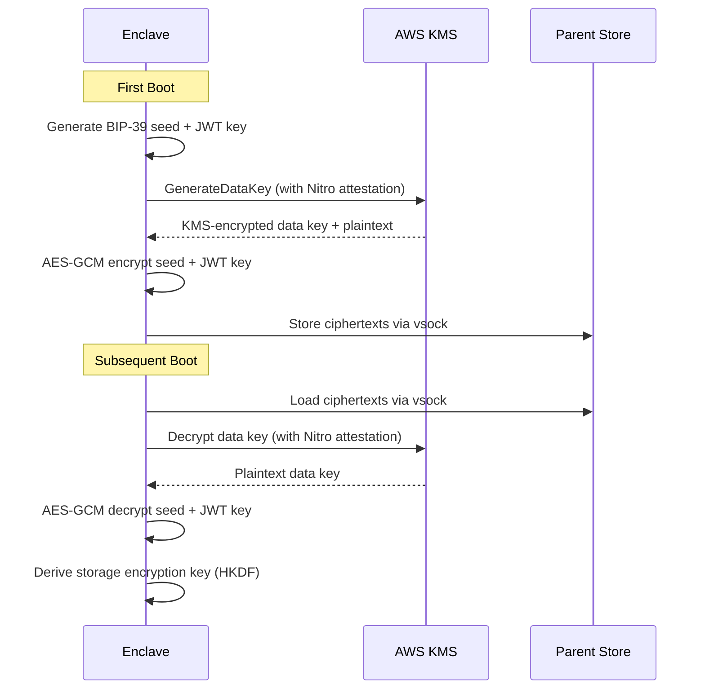

# VTA TEE Enclave Security Design

## Problem Statement

When the VTA runs inside a Trusted Execution Environment (Nitro Enclave or SEV-SNP),
we need to guarantee that:

1. **Secrets never leave the TEE in plaintext** — the master seed, JWT signing key,
   and all derived private keys exist only inside the enclave's isolated memory
2. **The VTA proves it's in a TEE before receiving secrets** — AWS KMS only releases
   secrets to an enclave that passes attestation with the correct PCR measurements
3. **Persistent storage is encrypted** — since enclaves are ephemeral, all data
   written to disk is encrypted inside the TEE and stored externally in ciphertext
4. **The design works identically outside a TEE** — non-TEE deployments continue
   to work with the existing storage and seed backends

## Architecture Overview

```
                         ┌─────────────────────────────────────────────────┐
                         │            Nitro Enclave (TEE)                  │
                         │                                                │
 ┌──────────┐  vsock     │  ┌─────────────────────────────────────────┐   │
 │ AWS KMS  │◄───────────┤  │           VTA Service                  │   │
 │          │────────────►│  │                                        │   │
 │ Key Policy:           │  │  1. Generate ephemeral RSA-2048 key    │   │
 │  PCR0 = <image hash>  │  │  2. Request NSM attestation doc with   │   │
 │  PCR3 = <iam role>    │  │     RSA public key embedded            │   │
 │  PCR8 = <signing cert>│  │  3. Call KMS Decrypt with Recipient =  │   │
 └──────────┘            │  │     { AttestationDocument, RSAES_OAEP }│   │
                         │  │  4. KMS verifies PCRs → re-encrypts    │   │
                         │  │     secrets to enclave's RSA pub key   │   │
                         │  │  5. Enclave decrypts with RSA priv key │   │
                         │  │  6. Seed + JWT key now in TEE memory   │   │
                         │  │     ┌─────────────────────┐            │   │
                         │  │     │ In-memory only:      │            │   │
                         │  │     │ • Master seed        │            │   │
                         │  │     │ • BIP-32 root key    │            │   │
                         │  │     │ • JWT signing key    │            │   │
                         │  │     │ • Derived privkeys   │            │   │
                         │  │     │ • Ephemeral RSA key  │            │   │
                         │  │     │ • AES storage key    │            │   │
                         │  │     └─────────────────────┘            │   │
                         │  │                                        │   │
                         │  │  Encrypted I/O:                        │   │
                         │  │  ┌──────────┐     ┌──────────────────┐ │   │
                         │  │  │ fjall API │ ──► │ EncryptedStore   │ │   │
                         │  │  │ (clear)   │ ◄── │ AES-256-GCM     │ │   │
                         │  │  └──────────┘     │ encrypt/decrypt  │ │   │
                         │  │                   └────────┬─────────┘ │   │
                         │  └────────────────────────────┼───────────┘   │
                         │                               │ vsock         │
                         └───────────────────────────────┼───────────────┘
                                                         ▼
                                                 ┌───────────────┐
                                                 │ Parent EC2    │
                                                 │ EBS Volume    │
                                                 │ (ciphertext)  │
                                                 └───────────────┘
```

## Design Principles

### 1. Zero-Trust Secret Bootstrapping

The VTA never receives plaintext secrets over any network channel. Both the
encrypt path (first boot) and decrypt path (subsequent boots) require Nitro
attestation, preventing an attacker with IAM role access from either reading
or overwriting secrets.

**First boot** (seed generation):

1. The VTA generates a master seed and JWT signing key inside the enclave
2. It generates an **ephemeral RSA-2048 key pair** and embeds the public key
   in an NSM attestation document
3. **KMS GenerateDataKey** with the `Recipient` parameter: KMS generates a
   random AES-256 data key, verifies the attestation (PCR0/PCR8), and returns
   the data key encrypted to the enclave's ephemeral RSA key (CMS envelope)
   plus a KMS-encrypted copy (CiphertextBlob) for storage
4. The enclave unwraps the CMS envelope, AES-GCM encrypts the seed and JWT
   key with the data key, and stores three items: the KMS-encrypted data key,
   and the two AES-GCM ciphertexts

**Subsequent boots** (seed recovery):

1. The VTA generates a fresh ephemeral RSA-2048 key pair and attestation document
2. **KMS Decrypt** with the `Recipient` parameter on the stored data key
   ciphertext: KMS verifies the attestation, decrypts the data key, and
   re-encrypts it to the ephemeral RSA key (CMS envelope)
3. The enclave unwraps the CMS envelope and AES-GCM decrypts the seed and
   JWT key using the recovered data key

**Key property**: Even if the parent EC2 instance is compromised, the attacker
cannot read KMS responses (encrypted to an ephemeral key inside the enclave)
and cannot encrypt rogue data (GenerateDataKey also requires attestation).

### 2. Secrets Never Leave the TEE

| Secret | Created | Stored | Exported |
|--------|---------|--------|----------|
| Master seed (32 bytes) | Generated in TEE | TEE memory only | Never |
| BIP-32 root key | Derived from seed | TEE memory only | Never |
| JWT signing key (32 bytes) | Generated in TEE | TEE memory only | Never |
| VTA identity keys (Ed25519/X25519) | Derived from root | TEE memory only | Public keys only |
| Ephemeral RSA key pair | Generated in TEE | TEE memory only | Public key in attestation doc |
| Storage encryption key (AES-256) | Derived from seed | TEE memory only | Never |
| Derived context private keys | Derived on demand | TEE memory (brief) | Only via encrypted export for context provisioning |

The only private key material that leaves the enclave is:
- **Public keys**: Always safe to export
- **Context provisioning bundles**: Encrypted with the recipient's public key
  (DIDComm envelope encryption — the enclave never sends plaintext private keys)
- **Key secrets endpoint** (`GET /keys/{id}/secret`): Returns private key material
  for authorized contexts. In TEE mode this should be further encrypted to the
  requesting DID's public key, or disabled entirely depending on security policy.

### 3. Encrypted External Storage

Since Nitro Enclaves are ephemeral, all fjall data must survive enclave restarts.
We encrypt all data inside the TEE before writing to disk:

```
VTA code → KeyspaceHandle.insert(key, value)
  → serde_json::to_vec(value)        # serialize
  → AES-256-GCM encrypt(plaintext)   # encrypt in TEE
  → write ciphertext to fjall        # persisted to parent EBS via vsock mount

Parent EBS has: { key: <plaintext>, value: <AES-256-GCM ciphertext + nonce + tag> }
```

The AES-256 storage key is **derived from the master seed** using HKDF:
```
storage_key = HKDF-SHA256(
    ikm = master_seed,
    salt = "vta-tee-storage-v1",
    info = "aes-256-gcm",
    len = 32
)
```

This means:
- The storage key is deterministic: same seed → same storage key → can decrypt
  data from previous enclave runs
- The storage key never leaves the TEE
- If the seed is rotated, the VTA must re-encrypt all existing data with the new
  storage key (as part of the seed rotation operation)

### 4. Dual-Mode Operation

The design must work both inside and outside a TEE:

| Concern | Non-TEE Mode | TEE Mode |
|---------|-------------|----------|
| Seed loading | SeedStore backends (keyring, config, cloud) | KMS attestation-based decrypt |
| JWT key loading | Config file / env var | KMS attestation-based decrypt |
| Storage | fjall plaintext JSON | fjall with AES-256-GCM encryption layer |
| Attestation | Not available | /attestation/* endpoints active |
| JWT claims | `tee_attested: false` | `tee_attested: true` |
| Key export | Direct plaintext | Encrypted to recipient's DID public key |

The implementation uses the existing `#[cfg(feature = "tee")]` gating plus
runtime checks (`tee_state.is_some()`) to switch behavior.

## Implementation Components

### Component 1: KMS Secret Bootstrap (`tee/kms_bootstrap.rs`)

```rust
/// Bootstrap secrets from KMS.
///
/// First boot: generate seed + JWT key, encrypt via KMS GenerateDataKey
/// Subsequent boots: decrypt via KMS Decrypt
/// Both paths use Nitro attestation when /dev/nsm is available.
pub async fn bootstrap_secrets(
    kms_config: &TeeKmsConfig,
    storage_key_salt: &str,
    store: &Store,
) -> Result<BootstrappedSecrets, AppError>;

pub struct TeeKmsConfig {
    pub region: String,
    pub key_arn: String,
    pub vta_did_template: Option<String>,
}

pub struct BootstrappedSecrets {
    pub seed: Vec<u8>,              // 32 bytes, plaintext in TEE memory
    pub jwt_signing_key: [u8; 32],  // plaintext in TEE memory
    pub storage_key: [u8; 32],      // derived from seed via HKDF
    pub entropy: Option<[u8; 32]>,  // only on first boot (for mnemonic export)
    pub is_first_boot: bool,
}
```

**Storage format** — three entries in the `bootstrap` keyspace:

| Key | Value |
|-----|-------|
| `bootstrap:data_key_ciphertext` | KMS-encrypted AES-256 data key (from `GenerateDataKey`) |
| `bootstrap:seed_ciphertext` | `[12-byte nonce][AES-256-GCM ciphertext]` — seed encrypted with data key |
| `bootstrap:jwt_ciphertext` | `[12-byte nonce][AES-256-GCM ciphertext]` — JWT key encrypted with data key |
| `bootstrap:jwt_fingerprint` | SHA-256 of JWT key (tamper detection) |

**Attested operations** use a shared helper that generates an ephemeral
RSA-2048 key pair, obtains an NSM attestation document binding the public
key, and builds a KMS `RecipientInfo`:

```rust
// Shared setup for attested KMS calls (decrypt and generate_data_key)
let (private_key, recipient) = nsm_attested_recipient()?;
let client = kms_client(config).await;

// First boot: GenerateDataKey with attestation
let resp = client.generate_data_key()
    .key_id(&config.key_arn)
    .key_spec(DataKeySpec::Aes256)
    .recipient(recipient)
    .send().await?;

let kms_ciphertext = resp.ciphertext_blob();         // store this
let data_key = unwrap_cms_response(                   // decrypt CMS envelope
    resp.ciphertext_for_recipient(), &private_key)?;

// AES-GCM encrypt both secrets with the data key
let seed_ct = aes_gcm_encrypt(&data_key, &seed)?;
let jwt_ct = aes_gcm_encrypt(&data_key, &jwt_key)?;
```

### Component 2: Encrypted Store Layer (`tee/encrypted_store.rs`)

A transparent encryption layer that wraps `KeyspaceHandle`:

```rust
/// Wraps a KeyspaceHandle to encrypt all values with AES-256-GCM.
///
/// In TEE mode, all data written to fjall passes through this layer.
/// In non-TEE mode, this layer is bypassed (identity transform).
pub struct EncryptedKeyspaceHandle {
    inner: KeyspaceHandle,
    /// AES-256-GCM key derived from master seed via HKDF
    key: Option<[u8; 32]>,
}

impl EncryptedKeyspaceHandle {
    /// Insert with encryption (TEE mode) or passthrough (non-TEE)
    pub async fn insert<V: Serialize>(&self, key: impl Into<Vec<u8>>, value: &V) -> Result<(), AppError> {
        let plaintext = serde_json::to_vec(value)?;
        if let Some(ref aes_key) = self.key {
            let ciphertext = aes_256_gcm_encrypt(aes_key, &plaintext)?;
            self.inner.insert_raw(key, ciphertext).await
        } else {
            self.inner.insert(key, value).await
        }
    }

    /// Get with decryption (TEE mode) or passthrough (non-TEE)
    pub async fn get<V: DeserializeOwned>(&self, key: impl AsRef<[u8]>) -> Result<Option<V>, AppError> {
        if let Some(ref aes_key) = self.key {
            let ciphertext = self.inner.get_raw(key).await?;
            match ciphertext {
                Some(ct) => {
                    let plaintext = aes_256_gcm_decrypt(aes_key, &ct)?;
                    Ok(Some(serde_json::from_slice(&plaintext)?))
                }
                None => Ok(None),
            }
        } else {
            self.inner.get(key).await
        }
    }
}
```

Each encrypted value has the structure:
```
[12-byte nonce][ciphertext][16-byte GCM auth tag]
```

The nonce is randomly generated per write using NSM-sourced entropy.

### Component 3: KMS Key Policy

The KMS key policy restricts both decrypt and data key generation to enclaves
with matching PCR measurements. There is no unconditional `kms:Encrypt`
statement — all data operations require attestation:

```json
{
    "Sid": "AllowEnclaveAttestationOperations",
    "Effect": "Allow",
    "Principal": {
        "AWS": "arn:aws:iam::ACCOUNT_ID:role/vta-enclave-role"
    },
    "Action": [
        "kms:Decrypt",
        "kms:GenerateDataKey"
    ],
    "Resource": "*",
    "Condition": {
        "StringEqualsIgnoreCase": {
            "kms:RecipientAttestation:PCR0": "<enclave-image-hash>",
            "kms:RecipientAttestation:PCR3": "<iam-role-hash>",
            "kms:RecipientAttestation:PCR8": "<signing-cert-hash>"
        }
    }
}
```

| PCR | What it measures | Why |
|-----|-----------------|-----|
| PCR0 | Enclave image hash | Ensures only this exact VTA build can decrypt |
| PCR3 | IAM role ARN hash | Ensures the parent EC2 instance has the correct role |
| PCR8 | Signing certificate hash | Ensures the EIF was signed by a trusted build pipeline |

**PCR0 changes** when the Docker image changes (any code update, dependency update,
or config change baked into the EIF). After each build, update the KMS key policy
with the new PCR0 value from `nitro-cli build-enclave` output.

### Component 4: Config Changes

```toml
[tee]
mode = "required"
embed_in_did = true
attestation_cache_ttl = 300
# Storage key derivation salt (change to invalidate all stored data)
storage_key_salt = "vta-tee-storage-v1"

# KMS-based secret bootstrap (TEE mode)
# On first boot, the VTA generates a seed and JWT key inside the enclave
# and encrypts them via KMS GenerateDataKey. No pre-encrypted ciphertexts needed.
[tee.kms]
region = "us-east-1"
key_arn = "arn:aws:kms:us-east-1:123456789012:key/abc-def-123"
# Optional: auto-generate a did:webvh identity on first boot
vta_did_template = "did:webvh:{SCID}:example.com:vta"
```

### Component 5: Startup Sequence (TEE Mode)

#### TEE Bootstrap Sequence



```
main()
  ↓
Load config
  ↓
init_tee()
  ├─ Detect /dev/nsm → NitroProvider
  ├─ mode == "required" → fail if no TEE
  ↓
bootstrap_secrets()
  ├─ First boot:
  │   ├─ Generate seed + JWT key inside TEE
  │   ├─ GenerateDataKey(Recipient=attestation_doc) → data key
  │   ├─ AES-GCM encrypt seed + JWT key with data key
  │   └─ Store: data_key_ciphertext + seed_ct + jwt_ct
  ├─ Subsequent boot:
  │   ├─ KMS Decrypt(data_key_ciphertext, Recipient=attestation_doc)
  │   ├─ AES-GCM decrypt seed + JWT key with recovered data key
  │   └─ Verify JWT fingerprint (tamper detection)
  ├─ Derive storage AES key = HKDF(seed, salt, "aes-256-gcm-storage")
  └─ Return BootstrappedSecrets { seed, jwt_key, storage_key }
  ↓
Open fjall Store
  └─ In TEE: wrap all keyspaces with EncryptedKeyspaceHandle
  ↓
init_auth()
  ├─ Use bootstrapped seed (not SeedStore backend)
  ├─ Use bootstrapped JWT key (not config file)
  └─ Derive VTA identity keys → secrets_resolver
  ↓
Start REST/DIDComm/Storage threads (normal flow)
```

In non-TEE mode, the startup sequence is unchanged — `bootstrap_secrets_from_kms()`
is skipped, and the existing SeedStore/config-based key loading is used.

## Secret Lifecycle Summary

```
┌─────────── Build Time ───────────┐
│                                  │
│  1. Build EIF with config.toml   │
│  2. Sign EIF → PCR8              │
│  3. Set KMS policy: PCR0 + PCR8  │
│  (No pre-encrypted secrets —     │
│   seed generated inside TEE)     │
│                                  │
└──────────────────────────────────┘
              │
              ▼
┌─────────── First Boot ───────────┐
│                                  │
│  4. VTA starts in Nitro Enclave  │
│  5. Generate seed + JWT key      │
│  6. GenerateDataKey (attested)   │
│     → data key + KMS ciphertext  │
│  7. AES-GCM encrypt secrets      │
│  8. Store: dk_ct + seed_ct +     │
│     jwt_ct + jwt_fingerprint     │
│  9. Derive storage AES key       │
│ 10. Auto-generate did:webvh      │
│                                  │
└──────────────────────────────────┘
              │
              ▼
┌─────────── Subsequent Boots ─────┐
│                                  │
│ 11. Decrypt data key (attested)  │
│ 12. AES-GCM decrypt seed + JWT   │
│ 13. Verify JWT fingerprint       │
│ 14. Derive same storage key      │
│ 15. Restore DID from store       │
│                                  │
│  Secrets in memory:              │
│  ✓ Seed, root key, JWT key      │
│  ✓ VTA signing + KA keys        │
│  ✓ Storage AES key              │
│  ✗ Nothing on disk unencrypted   │
│  ✗ Nothing sent over network     │
│                                  │
└──────────────────────────────────┘
              │
              ▼
┌─────────── Runtime ──────────────┐
│                                  │
│ 13. REST/DIDComm serve requests  │
│ 14. Key derivation on demand     │
│     (private keys ephemeral)     │
│ 15. fjall writes encrypted to    │
│     parent EBS via vsock         │
│ 16. Attestation endpoint serves  │
│     hardware-backed proofs       │
│                                  │
└──────────────────────────────────┘
              │
              ▼
┌─────────── Shutdown/Restart ─────┐
│                                  │
│ 17. TEE memory wiped (hardware)  │
│ 18. EBS has only ciphertext      │
│ 19. On restart: repeat 5-12      │
│     Same seed → same storage key │
│     → can decrypt previous data  │
│                                  │
└──────────────────────────────────┘
```

## Threat Model

| Threat | Mitigation |
|--------|-----------|
| Parent EC2 host compromise | Enclave memory isolated by Nitro hypervisor; KMS responses encrypted to ephemeral key; disk data encrypted with AES-256-GCM |
| Attacker builds malicious enclave | KMS policy checks PCR0 (image hash) — different image = KMS refuses to decrypt. PCR8 (signing cert) — unsigned image = KMS refuses. Signing key not on EC2. |
| Attacker modifies KMS policy | EC2 role only has `kms:Decrypt`/`kms:GenerateDataKey` (both attestation-gated), not `kms:PutKeyPolicy`. Admin role requires MFA + separate account. CloudTrail logs all policy changes. |
| Network MITM on vsock | KMS re-encrypts to enclave's ephemeral RSA key (even if TLS broken, attacker can't read response); DIDComm messages E2E encrypted |
| Disk theft / EBS snapshot | All fjall data AES-256-GCM encrypted; key derived from seed via HKDF; seed exists only in TEE memory |
| Cold boot attack | Nitro Enclaves use dedicated memory that's hardware-isolated; not accessible to parent; no DMA path |
| Attacker replays ciphertext files | Ciphertext is useless without KMS decryption; KMS requires attestation with correct PCR0 + PCR8 |
| Mnemonic exfiltration | Never displayed on console. Export requires: super admin auth + time-limited window + env var at boot. One-time use, entropy zeroed after export. |
| Signing key theft | Key stored in CI/CD or HSM, never on EC2. If stolen: revoke, generate new key, rebuild + re-sign, update PCR8 in KMS policy. |
| KMS key deletion | Recover from BIP-39 mnemonic backup with `vta tee recover` — create new KMS key and re-encrypt seed |
| Enclave restart | Deterministic storage key (derived from seed via HKDF) — new enclave instance can decrypt previous data |

### PCR Measurements Used in KMS Key Policy

| PCR | What it measures | Changes when | Purpose |
|-----|-----------------|-------------|---------|
| PCR0 | SHA-384 of entire enclave image | Any code, dependency, or config change | Pins the exact VTA binary |
| PCR3 | SHA-384 of IAM role ARN | IAM role changes | Prevents use of a different role |
| PCR8 | SHA-384 of EIF signing certificate | Signing key regeneration | Only your build pipeline can produce valid images |

### EIF Signing

Enclave images are signed with an EC P-384 key. The signing key lives in
the CI/CD pipeline (GitHub Actions secret, GitLab CI variable, or HSM) and
never touches the EC2 instance. The signing certificate's hash becomes PCR8,
which is checked by the KMS key policy.

Even if an attacker has the exact source code and Dockerfile, they cannot
produce a signed image without the signing private key — so PCR8 won't
match and KMS refuses to decrypt.

```bash
# Generate signing key (one-time, on secure build machine):
./deploy/nitro/generate-signing-key.sh ./signing

# Sign enclave image (in CI/CD):
nitro-cli build-enclave --docker-uri vta-nitro --output-file vta.eif \
    --signing-certificate ./signing/signing-cert.pem \
    --private-key ./signing/signing-key.pem

# Set up KMS policy with PCR0 + PCR8:
./deploy/nitro/setup-kms-policy.sh --pcr0 <hash> --pcr8 <hash> --role <arn>
```

## Implementation Phases

### Phase A: KMS Bootstrap
- New `tee/kms_bootstrap.rs` module
- Ephemeral RSA key generation using NSM
- KMS Decrypt with Recipient/AttestationDocument
- CMS envelope decryption (RFC 5652)
- New `KmsBootstrapConfig` in config
- Integration into `server.rs` startup sequence
- New `SeedStore` implementation: `KmsSeedStore` that wraps the bootstrapped seed

### Phase B: Encrypted Store
- New `tee/encrypted_store.rs` module
- `EncryptedKeyspaceHandle` wrapper
- AES-256-GCM encryption/decryption
- HKDF storage key derivation from seed
- Integration into `server.rs` (wrap keyspace handles in TEE mode)
- `insert_raw` / `get_raw` methods on `KeyspaceHandle` for byte-level access

### Phase C: External Storage
- vsock-mounted data directory for fjall
- fjall data_dir points to parent-mounted path
- Parent EBS volume holds encrypted data
- Backup/restore via S3 (data is already encrypted)

### Phase D: Key Export Protection
- In TEE mode, `GET /keys/{id}/secret` encrypts private key material
  to the requesting DID's public key before returning
- DIDComm `get-key-secret` handler applies same protection
- Context provisioning bundles already encrypt to recipient — verify this path

### Phase E: Operational Tooling
- `vta tee prepare-secrets` CLI command to encrypt seed + JWT key with KMS
- Script to update KMS key policy with new PCR0 after each build
- Health endpoint shows KMS bootstrap status
- Monitoring for attestation failures

## Dependencies

| Crate | Purpose | Feature-gated |
|-------|---------|---------------|
| `aws-sdk-kms` | KMS Decrypt/GenerateDataKey API | `tee` |
| `aws-nitro-enclaves-nsm-api` | NSM device: attestation docs, random | `tee` |
| `rsa` | Ephemeral RSA-2048 key generation | `tee` |
| `aes-gcm` | AES-256-GCM storage encryption | `tee` |
| `hkdf` + `sha2` | Storage key derivation | `tee` (sha2 already in workspace) |
| `cms` or manual ASN.1 | Parse CiphertextForRecipient (RFC 5652) | `tee` |

## References

- [AWS KMS Cryptographic Attestation for Nitro Enclaves](https://docs.aws.amazon.com/enclaves/latest/user/kms.html)
- [KMS Condition Keys for Nitro Enclaves](https://docs.aws.amazon.com/kms/latest/developerguide/conditions-nitro-enclaves.html)
- [AWS Nitro Enclaves NSM API](https://github.com/aws/aws-nitro-enclaves-nsm-api)
- [Nitro Enclaves CiphertextForRecipient Deep Dive](https://5blockchains.com/posts/nitro-enclaves/)
- [AWS Nitro Enclaves SDK (C)](https://github.com/aws/aws-nitro-enclaves-sdk-c)
- [How to Use AWS Nitro Enclaves Attestation Document](https://dev.to/aws-builders/how-to-use-aws-nitro-enclaves-attestation-document-2376)
- [NSM Attestation Process](https://github.com/aws/aws-nitro-enclaves-nsm-api/blob/main/docs/attestation_process.md)
- [Nitro Enclaves Persistent Storage (Anjuna)](https://docs.anjuna.io/latest/nitro/latest/getting_started/persistent_storage.html)
- [TEE Survey: Hardware-Supported Trusted Execution Environments (arXiv)](https://arxiv.org/pdf/2205.12742)
