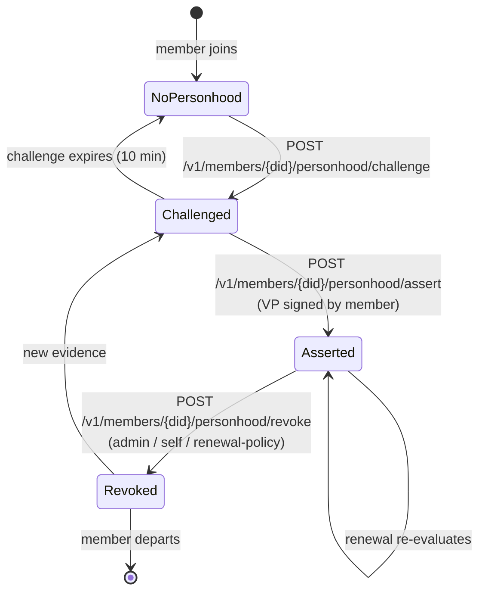
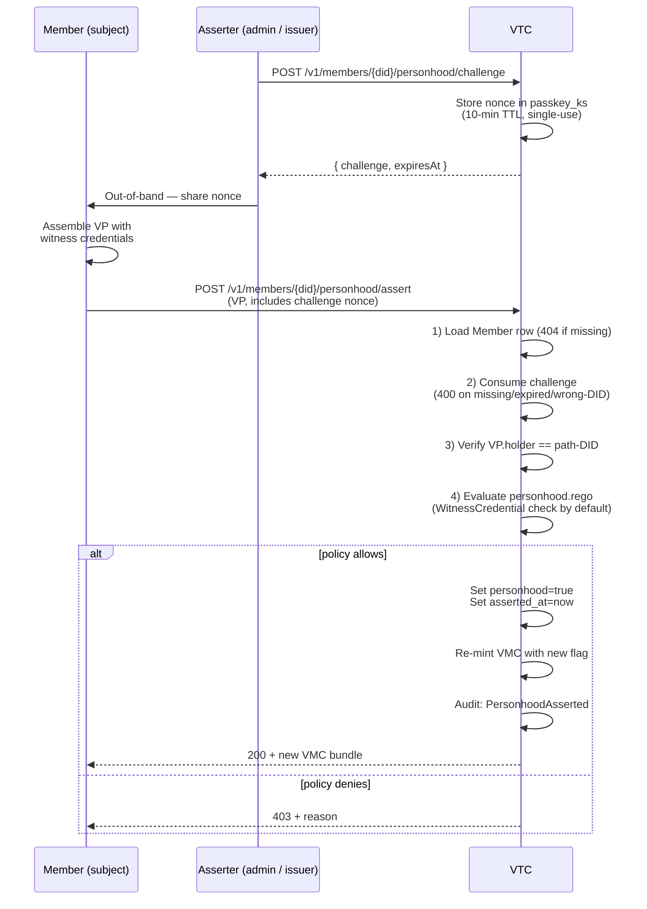
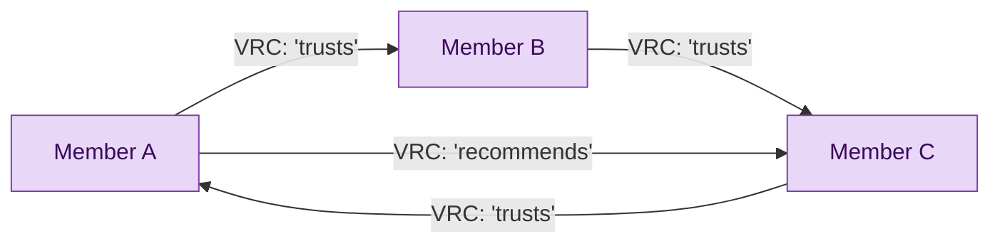
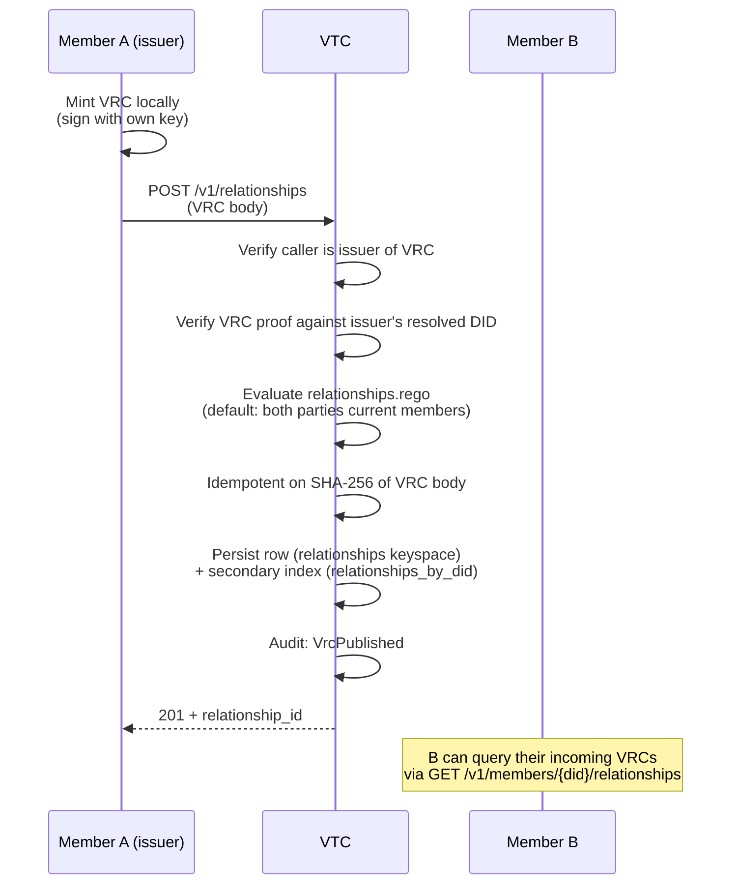

# Personhood + relationships

The VTC ships two member-graph features in Phase 4:

- **Personhood** — an admin/issuer asserts that a member is a
  unique human (or human-equivalent agent), backed by witness
  evidence the operator's `personhood.rego` accepts.
- **VRC graph** — members self-issue Verifiable Relationship
  Credentials declaring trust edges to other members, forming a
  community-internal trust graph.

Both surfaces are optional. Communities that don't need them never
emit the underlying audit events.

## Personhood lifecycle



The flag lives on the Member row alongside an `asserted_at`
timestamp; tombstoning a member wipes both fields.

### Assertion ceremony



**VP-only assert** (Phase 4 D2): the request body is purely a
Verifiable Presentation. The handler verifies the VP and discards
it — no `personhood_evidence` JSON field, no separate signed-blob
shape. The verify-then-discard semantics keep PII out of the
request log.

### Revocation

Three triggers:

| Trigger | Audit `reason` field |
|---|---|
| Admin via `DELETE /v1/members/{did}/personhood` | `"admin"` |
| Self via `DELETE /v1/members/me/personhood` | `"self"` |
| Renewal-policy downgrade (operator-configured) | `"renewal-policy"` |

The third is the operator-configurable failure mode discussed in
[`community-lifecycle.md`](community-lifecycle.md#renewal-failure-modes).

## VRC trust graph

A Verifiable Relationship Credential declares "I, member A, trust
member B in some specific way". The VTC stores the VRC if both
parties are current members (default policy); listing endpoints
strip VRCs naming a `Purge`-departed member.



### Publication



The secondary index makes the per-DID lookup O(matched rows)
rather than scanning the entire VRC table.

### Listing + filtering

`GET /v1/members/{did}/relationships` returns every VRC where the
DID is issuer or subject. The handler strips VRCs whose **other
party** has departed with `Purge` disposition — the VRC's
counter-party is permanently anonymised, so the listing hides the
relationship to preserve the §12.3 spec invariant.

VRCs naming a `Tombstone` or `Historical` departure stay visible
(the counter-party's DID is still recoverable).

### Self-issued only (MVP)

Bilateral counter-signing (where B confirms A's VRC) is **v2**.
For Phase 4, every VRC is self-issued by the originator.

## Custom endorsements

Phase 4 also adds operator-defined custom endorsements via an
in-process type registry. See [`credentials.md`](credentials.md)
for the issuance + revocation flow. Three pieces compose:

1. **Type registry** — admin uploads endorsement types
   (`POST /v1/endorsement-types`) with optional JSON schema for
   claim validation.
2. **Issuance** — Issuer role (or admin) calls
   `POST /v1/credentials/endorsements` with type + subject +
   claim.
3. **Revocation** — `DELETE /v1/credentials/endorsements/{id}`
   flips the shared status-list slot.

Reserved type URIs (`CommunityRole`) are blocked from operator
registration to keep the workspace's role taxonomy stable.

## Audit events

| Event | When emitted |
|---|---|
| `PersonhoodAsserted { reason, asserter_did_hash }` | Successful `assert` |
| `PersonhoodRevoked { reason, revoker_did_hash }` | Any revoke path |
| `VrcPublished { vrc_id, issuer_did_hash, subject_did_hash }` | `POST /v1/relationships` success |
| `VrcRevoked { vrc_id }` | `DELETE /v1/relationships/{id}` |
| `CustomEndorsementIssued { endorsement_id, type_uri, ... }` | Endorsement issuance |
| `CustomEndorsementRevoked { endorsement_id, type_uri }` | Endorsement revoke + paired `StatusListFlipped` |
| `EndorsementTypeRegistered { type_uri }` | Admin uploads type |
| `EndorsementTypeDeleted { type_uri }` | Admin deletes unused type |

All actor DIDs are HMAC-hashed per the §11.1 PII policy.

## CLI quick reference

```sh
# Personhood (admin / issuer view)
cnm members personhood challenge <did>
cnm members personhood assert <did> --vp ./evidence-vp.json
cnm members personhood revoke <did>

# Relationships (member view via pnm)
pnm vtc relationships list
pnm vtc relationships publish --subject did:key:zOther... --type 'trusts'
pnm vtc relationships revoke <id>
```

## See also

- [Community lifecycle](community-lifecycle.md) — personhood
  interacts with renewal failure modes.
- [Credentials](credentials.md) — VRC + custom endorsement
  status-list mechanics.
- [VTC MVP spec §6.4, §7, §12.3](../05-design-notes/vtc-mvp.md).
