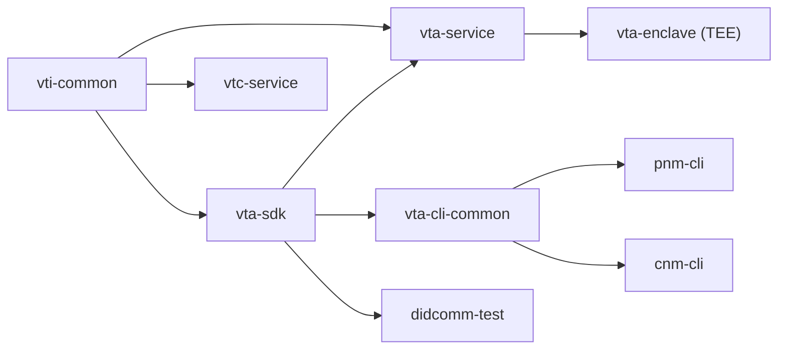
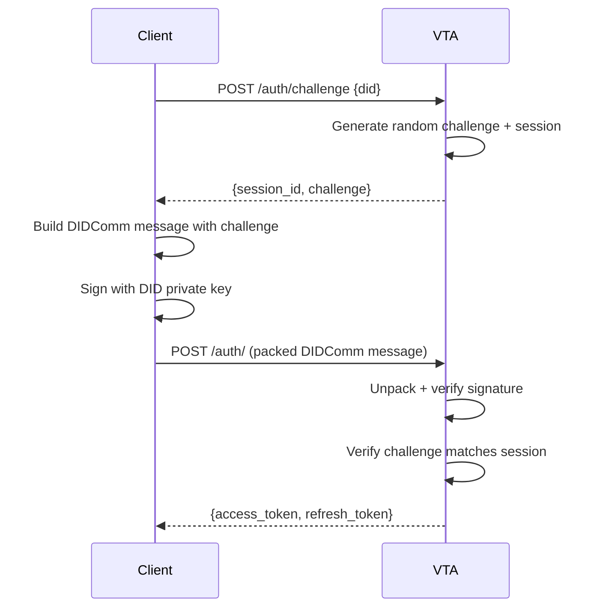
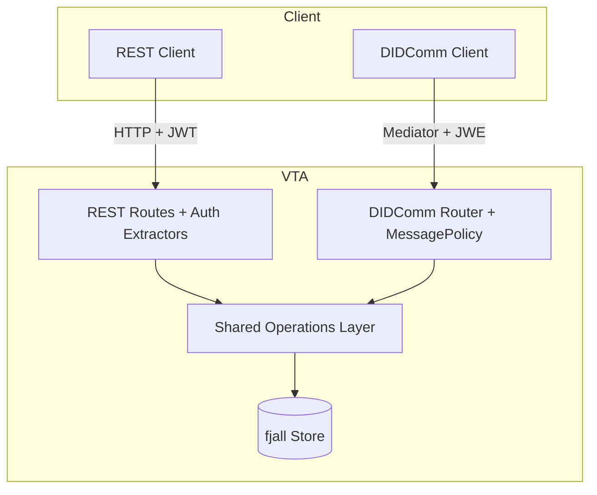

# VTA Service Design

This document describes the high-level architecture and design of the Verifiable
Trust Agent (VTA) service. The VTA manages cryptographic keys, DIDs, and access
control for a Verifiable Trust Community as part of the
[First Person Network](https://www.firstperson.network/white-paper).

## Workspace

The repository is a Rust workspace with nine crates:

```
verifiable-trust-infrastructure/
  vti-common/         Shared error types, utilities, and constants
  vta-sdk/            Data model (KeyRecord, ContextRecord, protocol constants)
  vta-service/        Axum HTTP service (this document's focus)
  vta-enclave/        TEE enclave wrapper (Nitro Enclaves / vsock proxy)
  vtc-service/        Verifiable Trust Community service
  vta-cli-common/     Shared CLI auth, config, and HTTP helpers
  pnm-cli/            Personal Network Manager CLI
  cnm-cli/            Community Network Manager CLI
  didcomm-test/       DIDComm integration test harness
```

`vti-common` provides foundational types used across the stack. `vta-sdk`
defines the data model; both the service and CLIs depend on it so
request/response types stay in sync. `vta-cli-common` factors out shared
CLI logic (authentication, HTTP client, credential management) consumed by
both `pnm-cli` and `cnm-cli`.



## Technology Stack

| Layer          | Choice                                   |
| -------------- | ---------------------------------------- |
| Web framework  | Axum 0.8                                 |
| Async runtime  | Tokio                                    |
| Storage        | fjall (embedded LSM key-value store)     |
| Cryptography   | ed25519-dalek, ed25519-dalek-bip32, p256 |
| DID resolution | affinidi-did-resolver-cache-sdk          |
| DIDComm        | affinidi-tdk (didcomm, secrets_resolver) |
| JWT            | jsonwebtoken (EdDSA / Ed25519)           |
| Seed storage   | OS keyring (keyring crate)               |

## Application State

All shared state lives in `AppState` (defined in `server.rs`):

```
AppState
  store            Store                                  fjall database handle
  keys_ks          KeyspaceHandle                         "keys" partition
  sessions_ks      KeyspaceHandle                         "sessions" partition
  acl_ks           KeyspaceHandle                         "acl" partition
  contexts_ks      KeyspaceHandle                         "contexts" partition
  cache_ks         KeyspaceHandle                         "cache" partition
  config           Arc<RwLock<AppConfig>>                  runtime-mutable config
  seed_store       Arc<KeyringSeedStore>                   OS keyring for master seed
  did_resolver     Option<DIDCacheClient>                  DID resolution (None before setup)
  secrets_resolver Option<Arc<ThreadedSecretsResolver>>    VTA DIDComm secrets (None before setup)
  jwt_keys         Option<Arc<JwtKeys>>                    JWT sign/verify keys (None before setup)
```

The three auth fields are `Option` so the server can start before setup has
run. When `None`, auth endpoints return an error directing the operator to
run setup first.

Keyspace handles wrap fjall partitions and expose async CRUD via
`tokio::spawn_blocking`. Structured values are JSON-serialized.

## Module Map

```
vta-service/src/
  main.rs          CLI entry (run server, setup, or offline commands)
  server.rs        Router construction, AppState init, graceful shutdown
  config.rs        TOML config with env var overrides
  error.rs         AppError enum -> HTTP responses
  status.rs        `vta status` -- offline stats and health check
  setup.rs         Interactive setup wizard (feature-gated "setup")
  import_did.rs    `vta import-did` -- offline ACL entry creation
  acl_cli.rs       `vta acl` -- offline ACL list/get/update/delete
  did_key.rs       `vta create-did-key` -- offline did:key creation
  did_webvh.rs     `vta create-did-webvh` -- offline did:webvh wizard (feature-gated "setup")

  auth/
    jwt.rs         EdDSA JWT encode/decode, PKCS8 DER key construction
    session.rs     Session lifecycle (ChallengeSent -> Authenticated), cleanup
    credentials.rs did:key credential generation
    extractor.rs   Axum extractors: AuthClaims, ManageAuth, AdminAuth

  acl/
    mod.rs         Role-based ACL (Admin, Initiator, Application)

  contexts/
    mod.rs         Application context CRUD, index allocation

  keys/
    derivation.rs  BIP-32 Ed25519/X25519/P-256 derivation trait
    paths.rs       Sequential path counter allocation
    seed_store.rs  OS keyring read/write for master seed

  store/
    mod.rs         fjall wrapper (Store, KeyspaceHandle)

  messaging/
    mod.rs         DIDComm router (route by message type)
    handlers/      Per-type DIDComm message handlers

  operations/
    backup.rs      Encrypted backup export/import logic

  metrics.rs       Prometheus-compatible metrics collection

  tee/
    mod.rs         TEE abstraction layer
    kms_bootstrap.rs   KMS-based seed unsealing for enclaves
    did_autogen.rs     Auto-generate VTA DID on first boot
    admin_bootstrap.rs Admin credential bootstrap in TEE mode
    mnemonic_guard.rs  Mnemonic access policy (TEE vs. dev)

  routes/
    mod.rs         Route table
    health.rs      GET /health
    auth.rs        Challenge-response, token issue/refresh, sessions
    config.rs      GET/PATCH /config
    keys.rs        Key CRUD + signing oracle
    contexts.rs    Context CRUD
    acl.rs         ACL CRUD
    cache.rs       Token cache (GET/PUT/DELETE)
```

## API Surface

### Public

| Method | Path    | Purpose          |
| ------ | ------- | ---------------- |
| GET    | /health | Status + version |

### Authentication

| Method | Path                 | Auth       | Purpose                             |
| ------ | -------------------- | ---------- | ----------------------------------- |
| POST   | /auth/challenge      | None (ACL) | Request DIDComm challenge           |
| POST   | /auth/               | None       | Submit signed challenge, get tokens |
| POST   | /auth/refresh        | None       | Refresh access token                |
| POST   | /auth/credentials    | Manage     | Generate did:key credential         |
| GET    | /auth/sessions       | Manage     | List sessions                       |
| DELETE | /auth/sessions/{id}  | Auth       | Revoke session                      |
| DELETE | /auth/sessions?did=X | Admin      | Revoke all sessions for a DID       |

### Configuration

| Method | Path    | Auth        | Purpose       |
| ------ | ------- | ----------- | ------------- |
| GET    | /config | Auth        | Read config   |
| PATCH  | /config | Super Admin | Update config |

### Keys

| Method | Path                  | Auth  | Purpose                                 |
| ------ | --------------------- | ----- | --------------------------------------- |
| GET    | /keys                 | Auth  | List (filtered by context access)       |
| POST   | /keys                 | Admin | Create (context access checked)         |
| GET    | /keys/{key_id}        | Auth  | Get key record (context access checked) |
| DELETE | /keys/{key_id}        | Admin | Invalidate key (context access checked) |
| PATCH  | /keys/{key_id}        | Admin | Rename key (context access checked)     |
| GET    | /keys/{key_id}/secret | Admin | Export private key material              |
| POST   | /keys/{key_id}/sign   | Auth  | Sign payload (signing oracle)           |

### Cache

| Method | Path         | Auth | Purpose                         |
| ------ | ------------ | ---- | ------------------------------- |
| GET    | /cache/{key} | Auth | Retrieve cached value           |
| PUT    | /cache/{key} | Auth | Store value with TTL            |
| DELETE | /cache/{key} | Auth | Delete cached value             |

### Contexts

| Method | Path           | Auth        | Purpose                            |
| ------ | -------------- | ----------- | ---------------------------------- |
| GET    | /contexts      | Auth        | List contexts (filtered by access) |
| POST   | /contexts      | Super Admin | Create context                     |
| GET    | /contexts/{id} | Auth        | Get context (access checked)       |
| PATCH  | /contexts/{id} | Super Admin | Update context                     |
| DELETE | /contexts/{id} | Super Admin | Delete context                     |

### ACL

| Method | Path       | Auth   | Purpose      |
| ------ | ---------- | ------ | ------------ |
| GET    | /acl/      | Manage | List entries |
| POST   | /acl/      | Manage | Create entry |
| GET    | /acl/{did} | Manage | Get entry    |
| PATCH  | /acl/{did} | Manage | Update entry |
| DELETE | /acl/{did} | Manage | Delete entry |

### VTA Management

| Method | Path            | Auth  | Purpose                     |
| ------ | --------------- | ----- | --------------------------- |
| POST   | /vta/restart    | Admin | Trigger soft restart        |

### Backup

| Method | Path            | Auth  | Purpose                     |
| ------ | --------------- | ----- | --------------------------- |
| POST   | /backup/export  | Admin | Export encrypted backup      |
| POST   | /backup/import  | Admin | Import encrypted backup      |

Auth levels: **Auth** = any valid JWT, **Manage** = Admin or Initiator,
**Admin** = Admin role only, **Super Admin** = Admin with empty
`allowed_contexts`.

## Authentication

Authentication uses a DIDComm-based challenge-response flow:



### JWT Claims

```json
{
  "aud": "VTA",
  "sub": "did:...",
  "session_id": "uuid",
  "role": "admin",
  "contexts": ["vta", "mediator"],
  "exp": 1738000000
}
```

The JWT is signed with an Ed25519 key (PKCS8 v1 DER) stored in the config
file. Access tokens default to 15 minutes; refresh tokens to 24 hours.

### Session Lifecycle

Sessions progress through two states:

1. **ChallengeSent** -- created at `/auth/challenge`, expires after
   `challenge_ttl` (default 300s).
2. **Authenticated** -- set at `/auth/`, includes refresh token and expiry.

A background task runs every `session_cleanup_interval` seconds and removes
expired sessions from both states.

## Authorization Model

### Roles

| Role        | Capabilities                                               |
| ----------- | ---------------------------------------------------------- |
| Admin       | Full access; unrestricted when `allowed_contexts` is empty |
| Initiator   | Can manage ACL entries and view resources                  |
| Application | Read-only access to keys, contexts, config                 |

### Admin Types

The Admin role has two tiers based on `allowed_contexts`:

| Type          | `allowed_contexts` | Access                                           |
| ------------- | ------------------ | ------------------------------------------------ |
| Super admin   | `[]` (empty)       | Unrestricted: config, contexts, all keys and ACL |
| Context admin | `["vta", ...]`     | Keys and ACL within assigned contexts only       |

No additional role enum values are needed. The distinction is purely based
on whether `allowed_contexts` is empty.

### Super Admin Requirements

The following operations require super admin:

- **Contexts:** create, update, delete (`POST/PATCH/DELETE /contexts/{id}`)
- **Config:** update (`PATCH /config`)
- **Keys:** create or manage keys without a `context_id`
- **ACL:** create entries with empty `allowed_contexts`

### Context-Scoped Access

Each ACL entry carries an `allowed_contexts` list. When non-empty, the
holder can only access resources within those contexts. An Admin with an
empty list has unrestricted access (super admin). The list propagates into
JWT claims and is re-evaluated on token refresh.

**List filtering:** Context-scoped users only see resources that belong to
their assigned contexts:

- `GET /contexts` — only contexts in `allowed_contexts`
- `GET /keys` — only keys whose `context_id` is in `allowed_contexts`
- `GET /acl/` — only entries whose `allowed_contexts` overlap with the caller's

**Single-resource access:** `GET /contexts/{id}`, `GET /keys/{key_id}`, and
`GET /acl/{did}` validate that the caller has access to the resource's context.

### Privilege Escalation Prevention

Context admins cannot:

- Create or modify ACL entries with empty `allowed_contexts` (would grant
  super admin access).
- Grant access to contexts they don't have access to themselves.
- Generate credentials (`POST /auth/credentials`) with broader context
  access than their own.

## Key Management

### BIP-32 Hierarchy

All keys derive from a single BIP-39 mnemonic seed under `m/26'` (reserved
for First Person Network):

```
m/26'/2'/N'/K'
         |   |
         |   +-- Key index (sequential counter per context)
         +------ Context index (0=vta, 1+=additional contexts)
```

See [`bip32_paths.md`](bip32_paths.md) for the full specification.

### Key Types

- **Ed25519** -- signing, authentication, assertion. Multibase prefix `z6Mk`.
- **X25519** -- key agreement (Diffie-Hellman). Derived from Ed25519 private
  key via clamping. Multibase prefix `z6LS`.
- **P-256** -- ECDSA signing (ES256). Used for PAT JWT signing and other
  standards requiring NIST curves. Derived via HMAC-SHA512 domain separation
  from BIP-32 path material (see [`bip32_paths.md`](bip32_paths.md)).

### Key Record

```rust
KeyRecord {
    key_id:          String,          // "did:webvh:...#key-0"
    derivation_path: String,          // "m/26'/2'/0'/0'"
    key_type:        KeyType,         // Ed25519 | X25519 | P256
    status:          KeyStatus,       // Active | Revoked
    public_key:      String,          // multibase
    label:           Option<String>,
    context_id:      Option<String>,  // "vta", "mediator", etc.
    created_at:      DateTime<Utc>,
    updated_at:      DateTime<Utc>,
}
```

### Seed Storage

The master seed (64 bytes from BIP-39 or 32 bytes random) is stored
hex-encoded in the OS keyring under service `vta`, user `master_seed`.
It never touches disk.

## Application Contexts

Contexts group keys and DIDs into logical units:

```rust
ContextRecord {
    id:          String,          // slug: "vta", "mediator"
    name:        String,          // "Verifiable Trust Agent"
    did:         Option<String>,  // set after DID creation
    description: Option<String>,
    base_path:   String,          // "m/26'/2'/0'"
    index:       u32,             // position in hierarchy
    created_at:  DateTime<Utc>,
    updated_at:  DateTime<Utc>,
}
```

Three contexts are seeded during setup. Additional contexts are created via
`POST /contexts` and receive the next available index. Each context's keys
share a sequential counter so indices are unique within the context.

## DID Methods

### did:key

Simple, self-contained identifiers. An Ed25519 public key is multibase-encoded
to produce `did:key:z6Mk...`. Used for admin and application credentials
generated via `/auth/credentials`. The private key is returned as a base64
credential string that the holder imports into the CLI.

### did:webvh (Web Verifiable History)

Production identifiers for the VTA, mediator, and organizational entities.
Features:

- **Self-certifying** -- the SCID is derived from the initial DID document.
- **Portable** -- the DID can move between domains.
- **Pre-rotation** -- future key hashes are committed in advance.
- **Verifiable history** -- a signed log (`did.jsonl`) records every update.

A typical DID document includes:

- `verificationMethod` with Ed25519 (signing) and X25519 (key agreement) keys.
- `authentication` and `assertionMethod` referencing the signing key.
- `keyAgreement` referencing the X25519 key.
- `service` with a `DIDCommMessaging` endpoint routing through the mediator.

## Request Flow

The VTA exposes two parallel ingress paths that converge on a shared
operations layer:



## DIDComm Messaging

The VTA uses DIDComm v2 for authenticated communication:

1. **Server side** -- at startup the VTA's signing and key-agreement secrets
   are loaded into a `ThreadedSecretsResolver`. Incoming DIDComm messages are
   unpacked with `Message::unpack_string()` which decrypts and verifies
   signatures using the DID resolver and secrets resolver.

2. **Client side** -- the CLI builds DIDComm messages with `from` (client DID)
   and `to` (VTA DID), packs them encrypted via `pack_encrypted()`, and sends
   the ciphertext as the HTTP body.

Message types used:

| Type URI                                            | Purpose            |
| --------------------------------------------------- | ------------------ |
| `https://affinidi.com/atm/1.0/authenticate`         | Challenge response |
| `https://affinidi.com/atm/1.0/authenticate/refresh` | Token refresh      |

### Signing Oracle

The VTA can act as a **signing oracle**: clients send unsigned payloads to
`POST /keys/{key_id}/sign` (or the DIDComm `sign-request` message type),
and the VTA derives the key from BIP-32, signs in memory, and returns the
base64url-encoded signature. Key material never leaves VTA and is dropped
immediately after signing.

Supported algorithms:

| Algorithm | Key Type | Signature Format |
| --------- | -------- | ---------------- |
| `eddsa`   | Ed25519  | 64-byte Ed25519  |
| `es256`   | P256     | 64-byte ECDSA    |

### Token Cache

The VTA provides a simple key-value cache scoped per caller DID for storing
short-lived tokens (PATs, access tokens). Entries support TTL-based expiry
with lazy cleanup on read.

| Method | Path         | Purpose                |
| ------ | ------------ | ---------------------- |
| GET    | /cache/{key} | Read (404 if expired)  |
| PUT    | /cache/{key} | Write with TTL         |
| DELETE | /cache/{key} | Delete                 |

## Configuration

Configuration loads from a TOML file with environment variable overrides:

| Section   | Key Fields                          | Env Prefix     |
| --------- | ----------------------------------- | -------------- |
| (root)    | vta_did, community_name             | VTA\_          |
| services  | rest, didcomm                       | —              |
| server    | host, port                          | VTA*SERVER*    |
| log       | level, format                       | VTA*LOG*       |
| store     | data_dir                            | VTA*STORE*     |
| messaging | mediator_url, mediator_did          | VTA*MESSAGING* |
| auth      | token expiries, jwt_signing_key     | VTA*AUTH*      |

`vta_did` and `community_name` are mutable at runtime via `PATCH /config`.

## Setup Wizard

Running `vta setup` launches the wizard. Interactive by default;
`vta setup --from <file>` reads a TOML inputs file and runs end-to-end
without prompts (CI / sealed images / unattended bootstrap — see
[`non-interactive-setup.md`](non-interactive-setup.md)).

1. Collect server, logging, and storage configuration.
2. Create the `vta` seed context (and `mediator` if DIDComm is enabled).
3. Generate a fresh BIP-39 mnemonic; store seed in the chosen backend
   (OS keyring by default). The wizard does not accept an
   operator-supplied mnemonic — pasting one into a terminal exposes it
   to history, scrollback, and clipboard. Use
   `vta keys rotate-seed --mnemonic "<phrase>"` post-setup if a known
   seed is required.
4. Generate a random JWT signing key.
5. Create mediator did:webvh (signing + key-agreement keys, DID log file).
6. Create VTA did:webvh with DIDComm service pointing to the mediator.
7. Create admin identity (did:key credential, did:webvh, or existing DID).
8. Bootstrap ACL with admin entry.
9. Persist store and write `config.toml`.

The wizard is feature-gated behind `"setup"` so production builds can
exclude the dialoguer dependency. Both interactive and `--from` paths
share the gate.

## Storage Layout

All data lives in fjall keyspaces:

| Keyspace | Key Pattern                | Value                |
| -------- | -------------------------- | -------------------- |
| keys     | `key:{key_id}`             | KeyRecord (JSON)     |
| keys     | `path_counter:{base_path}` | u32 (LE bytes)       |
| sessions | `session:{session_id}`     | Session (JSON)       |
| sessions | `refresh:{token}`          | session_id bytes     |
| acl      | `acl:{did}`                | AclEntry (JSON)      |
| contexts | `ctx:{id}`                 | ContextRecord (JSON) |
| contexts | `ctx_counter`              | u32 (LE bytes)       |
| cache    | `cache:{did}:{key}`        | CacheEntry (JSON)    |

## VTA CLI

The VTA binary serves as both the HTTP server (when run without a subcommand)
and a set of offline management commands that operate directly on the store:

```
vta                                     Start the HTTP service
vta setup [--from FILE]                 Setup wizard (interactive or TOML-driven)
vta status                              Show config, contexts, keys, ACL, sessions
vta config show                         Print VTA identity / service settings
vta export-admin                        Export admin DID and credential
vta bootstrap-admin --did DID           Seed first super-admin and seal the VTA
vta create-did-key --context ID         Create a did:key in a context
vta create-did-webvh --context ID       Create a did:webvh interactively
vta import-did --did DID [--role ...]   Import external DID into ACL
vta acl list [--context ...] [--role ...] List ACL entries
vta acl get <did>                       Show ACL entry details
vta acl update <did> [--role ...]       Update ACL entry
vta acl delete <did> [--yes]            Delete ACL entry
vta keys list / secrets / seeds / rotate-seed [--mnemonic PHRASE]
                                        Key + seed management

# Sealed-transfer bootstrap (consumer side — cold-start without pnm)
vta bootstrap request --out FILE [--label TEXT] [--seed-dir PATH]
vta bootstrap open    --bundle FILE --expect-digest HEX [--seed-dir PATH]

# Sealed-transfer bootstrap (producer side — VTA host)
vta bootstrap seal                  --request REQ --payload PAYLOAD --out BUNDLE
vta bootstrap provision-integration --request REQ --context ID      --out BUNDLE
```

## CLI References

See [pnm-cli/README.md](../pnm-cli/README.md) and [cnm-cli/README.md](../cnm-cli/README.md) for CLI references.
